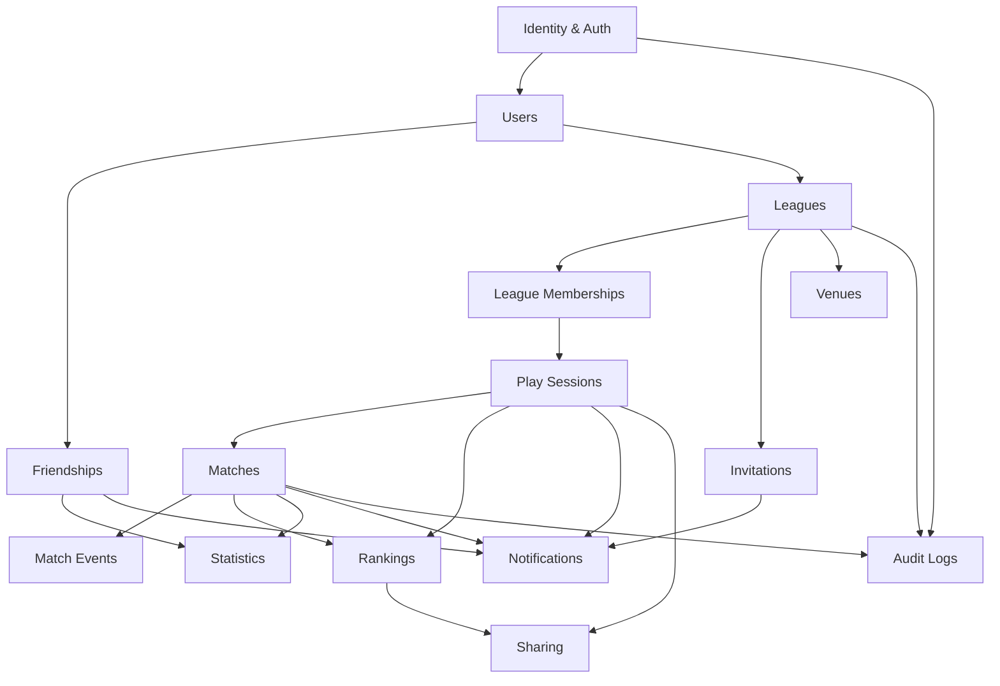

# 4. Domínios e módulos do backend

## 4.1 Visão geral da arquitetura

**Decisão arquitetural `[R]`: monólito modular** em .NET, com Clean Architecture e fronteiras de módulo explícitas — **não** microsserviços no MVP.

Justificativa: o domínio é fortemente transacional e acoplado por natureza (finalizar uma partida atualiza ranking da liga, ranking da jogatina, estatísticas do usuário e dispara notificações — tudo consistente). Distribuir isso no dia 1 troca um `BEGIN/COMMIT` por saga distribuída sem nenhum ganho de escala real (< 5 mil partidas/dia). Os módulos são desenhados para poderem ser extraídos depois; hoje compartilham processo e banco.

```
┌──────────────────────────────────────────────────────────────┐
│  Encacapei.Api  (ASP.NET Core — controllers, filtros, auth)  │
├──────────────────────────────────────────────────────────────┤
│  Encacapei.Application  (casos de uso, DTOs, políticas,      │
│                          validators, handlers de evento)     │
├──────────────────────────────────────────────────────────────┤
│  Encacapei.Domain  (entidades, VOs, invariantes, eventos     │
│                     de domínio) — SEM dependência externa    │
├──────────────────────────────────────────────────────────────┤
│  Encacapei.Infrastructure  (EF Core, Blob, e-mail, push,     │
│                             outbox, cache, geo)              │
├──────────────────────────────────────────────────────────────┤
│  Encacapei.Worker  (jobs agendados + consumidores do outbox) │
└──────────────────────────────────────────────────────────────┘
```

**Regras de fronteira `[R]`:**
- Um módulo **nunca** consulta a tabela de outro diretamente. Acesso cruzado é via interface de aplicação (`ILeagueQueries`) ou por evento de domínio.
- Referências entre agregados são por **ID**, nunca por navegação de objeto (`Match.LeagueId`, não `Match.League`).
- Chaves estrangeiras físicas **existem** no banco (integridade importa mais que pureza no MVP), mas o código não faz join cross-módulo em escrita.
- Consultas de leitura cross-módulo (Home, ranking, h2h) usam **read models** dedicados / views, não o agregado de escrita.

### Mapa de dependências entre módulos



---

## 4.2 Identity & Auth

| Item | Conteúdo |
|---|---|
| **Responsabilidade** | Provar quem é o usuário e manter sessões. Cadastro em etapas, política de senha, emissão/rotação/revogação de tokens, verificação de e-mail, reset e troca de senha. Não conhece liga, partida ou amizade. |
| **Entidades** | `UserCredential`, `RefreshToken` (session family), `EmailVerificationToken`, `PasswordResetToken`, `LoginAttempt` |
| **Casos de uso** | `RegisterUser`, `Login`, `RefreshTokens`, `Logout`, `LogoutAllSessions`, `RequestPasswordReset`, `ResetPassword`, `ChangePassword`, `VerifyEmail`, `ResendVerificationEmail`, `CheckUsernameAvailability` |
| **Dependências** | Users (cria o `User` na mesma transação do registro), provedor de e-mail, cache distribuído (rate limit + denylist de `jti`) |
| **Eventos produzidos** | `UserRegistered`, `EmailVerified`, `PasswordChanged`, `PasswordResetRequested`, `SessionRevoked`, `SuspiciousRefreshDetected` |
| **Eventos consumidos** | `AccountDeletionRequested` (revoga todas as sessões) |
| **Telas atendidas** | Login/Cadastro, Perfil → Alterar senha / Sair |
| **Invariantes** | E-mail único (case-insensitive); hash Argon2id; refresh token de uso único com detecção de reuso; token de reset de uso único com TTL de 30 min |

---

## 4.3 Users

| Item | Conteúdo |
|---|---|
| **Responsabilidade** | Perfil do jogador: nome de exibição, `@username` único, avatar, preferências, visibilidade, ciclo de vida da conta (ativa, desativada, anonimizada). |
| **Entidades** | `User`, `UserProfileSettings`, `UserDevice` (compartilhada com Notifications), `DataExportRequest` |
| **Casos de uso** | `GetMyProfile`, `UpdateMyProfile`, `UploadAvatar` (SAS + confirmação), `SearchUsers`, `GetPublicUser`, `DeactivateAccount`, `RequestAccountDeletion`, `RequestDataExport` |
| **Dependências** | Blob Storage (avatar), Statistics (compõe o perfil), Friendships (define `relationshipStatus` no resultado de busca) |
| **Eventos produzidos** | `UserProfileUpdated`, `UsernameChanged`, `AccountDeactivated`, `AccountDeletionRequested`, `AccountAnonymized` |
| **Eventos consumidos** | `UserRegistered` (cria perfil), `MatchFinished` (invalida cache de perfil resumido) |
| **Telas atendidas** | Home (cabeçalho), Perfil, Amigos (busca), H2H (topbar) |
| **Invariantes** | `username` único, imutável nos primeiros 30 dias após troca (`DP-024`); `displayName` 2–60 chars; conta anonimizada mantém `id` para preservar histórico de partidas |

---

## 4.4 Friendships

| Item | Conteúdo |
|---|---|
| **Responsabilidade** | Grafo social simétrico: convites, amizades, remoção e (pós-MVP) bloqueio. É pré-requisito social para convidar para liga, mas **não** para jogar. |
| **Entidades** | `FriendRequest`, `Friendship`, `UserBlock` (pós-MVP) |
| **Casos de uso** | `SendFriendRequest`, `AcceptFriendRequest`, `DeclineFriendRequest`, `CancelFriendRequest`, `ListFriends`, `ListFriendRequests`, `RemoveFriend`, `BlockUser` |
| **Dependências** | Users, Notifications |
| **Eventos produzidos** | `FriendRequestSent`, `FriendRequestAccepted`, `FriendRequestDeclined`, `FriendRequestCancelled`, `FriendshipRemoved`, `UserBlocked` |
| **Eventos consumidos** | `AccountDeletionRequested` (remove amizades) |
| **Telas atendidas** | Amigos (2 abas), Notificações (convites de amigos), seleção de convidados de liga |
| **Invariantes** | Amizade é **simétrica e única** por par (armazenada com `userAId < userBId` para garantir unicidade); não pode haver dois `FriendRequest PENDING` no mesmo par; convite recíproco auto-aceita |

**Decisão de modelagem `[R]`: `FriendRequest` e `Friendship` são entidades separadas.**
Alternativa considerada: tabela única `Friendship` com `status ∈ {PENDING, ACCEPTED}` e direção. Rejeitada porque amizade é **não-direcionada** e convite é **direcionado**; unificar obriga a carregar `requesterId`/`addresseeId` em toda consulta de amizade e complica o índice de unicidade simétrica. Separar custa uma tabela e paga em clareza de consulta.

---

## 4.5 Leagues

| Item | Conteúdo |
|---|---|
| **Responsabilidade** | A liga é o **agregado raiz** do produto: identidade, local, visibilidade, duração, calendário, regras de jogo e ciclo de vida. |
| **Entidades** | `League` (raiz), `LeagueRule` (1:1), `LeagueSchedule` (1:1 + dias da semana) |
| **Casos de uso** | `CreateLeague`, `GetLeague`, `ListMyLeagues`, `SearchPublicLeagues`, `UpdateLeague`, `FinishLeague`, `DeleteLeague`, `ComputeNextSession` |
| **Dependências** | Venues (validar `venueId`), League Memberships, Rankings |
| **Eventos produzidos** | `LeagueCreated`, `LeagueUpdated`, `LeagueRulesChanged`, `LeagueFinished`, `LeagueDeleted` |
| **Eventos consumidos** | `MatchFinished` (atualiza `matchesCount`, `lastActivityAt`), `LeagueMemberJoined/Left` (atualiza `membersCount`) |
| **Telas atendidas** | Ligas (lista + busca pública), Wizard, Liga detalhe (topbar + Config), Home |
| **Invariantes** | Exatamente 1 `OWNER`; `ONE_DAY` gera `endsAt = startsAt + 1 dia`; liga `FINISHED` é imutável exceto por admin de plataforma; `gameMode` e `rules` congelam após a 1ª partida finalizada (`DP-008`) |

**Decisão de modelagem `[R]`: `LeagueRule` e `LeagueSchedule` são tabelas separadas, não colunas em `League`.**
`LeagueSchedule` precisa de N linhas de dia da semana (`Ter` + `Sex`) — array ou tabela filha. `LeagueRule` é separada porque tende a crescer (bola 8 obrigatória? tempo limite? handicap?) e porque **versionar regra** é requisito futuro previsível (ranking de uma liga cuja regra mudou no meio). No MVP a regra é 1:1 e substituída in place, com `AuditLog`.

---

## 4.6 League Memberships

| Item | Conteúdo |
|---|---|
| **Responsabilidade** | Quem pertence à liga, com qual papel, desde quando, e o histórico de saída. É a base de **toda** a autorização de liga. |
| **Entidades** | `LeagueMember` |
| **Casos de uso** | `ListMembers`, `JoinLeague`, `JoinByCode`, `LeaveLeague`, `ChangeMemberRole`, `RemoveMember`, `TransferOwnership` |
| **Dependências** | Leagues, Users, Invitations, Rankings (entrada cria `RankingEntry` zerada) |
| **Eventos produzidos** | `LeagueMemberJoined`, `LeagueMemberLeft`, `LeagueMemberRemoved`, `LeagueMemberRoleChanged`, `LeagueOwnershipTransferred` |
| **Eventos consumidos** | `LeagueInvitationAccepted`, `AccountDeletionRequested` |
| **Telas atendidas** | Liga → Config (convidar/gerenciar), seleção de adversário (lista de membros), ranking |
| **Invariantes** | Par (`leagueId`, `userId`) único entre membros **ativos**; sair não apaga o histórico de partidas; `OWNER` não pode sair sem transferir; membro que saiu e volta reaproveita a mesma linha (`status: ACTIVE` novamente) mantendo estatísticas |

**Decisão `[R]`: membro que sai é `status = LEFT`, não linha deletada.** O ranking histórico e o histórico de partidas precisam resolver o nome do jogador; e o `unique index` de membro ativo é parcial (`WHERE status = 'ACTIVE'`).

---

## 4.7 Invitations

| Item | Conteúdo |
|---|---|
| **Responsabilidade** | Dois mecanismos distintos de entrada em liga: **convite nominal** (endereçado a um usuário) e **código de convite** (string compartilhável no WhatsApp). |
| **Entidades** | `LeagueInvitation`, `LeagueInviteCode` |
| **Casos de uso** | `InviteUsersToLeague`, `ListMyLeagueInvitations`, `AcceptLeagueInvitation`, `DeclineLeagueInvitation`, `RevokeLeagueInvitation`, `GenerateInviteCode`, `RevokeInviteCode`, `JoinByCode`, `PreviewInviteCode` |
| **Dependências** | Leagues, Users, League Memberships, Notifications |
| **Eventos produzidos** | `LeagueInvitationSent`, `LeagueInvitationAccepted`, `LeagueInvitationDeclined`, `LeagueInvitationExpired`, `InviteCodeGenerated`, `InviteCodeRedeemed` |
| **Eventos consumidos** | `LeagueFinished` (expira convites pendentes) |
| **Telas atendidas** | Ligas (card amarelo), Wizard passo 3, Config da liga, Notificações |
| **Invariantes** | Convite tem `expiresAt` (default **7 dias**, `DP-019`); no máximo 1 convite `PENDING` por (`leagueId`, `inviteeUserId`); código é único globalmente, tem `maxUses` e `expiresAt`; aceitar convite de liga `FINISHED` falha com `LEAGUE_FINISHED` |

**Por que separar de Friendships:** convite de liga e convite de amizade têm ciclo de vida, expiração, autorizações e notificações diferentes. Unificar em "Invitation polimórfica" economizaria uma tabela e criaria um `switch` em todo caso de uso. **Mantidos separados.**

---

## 4.8 Play Sessions (jogatinas)

| Item | Conteúdo |
|---|---|
| **Responsabilidade** | A "noite de jogo": agrupa as partidas de um dia de uma liga, registra quem apareceu e produz o **pódio do dia**. É a unidade natural do compartilhamento e do head-to-head. |
| **Entidades** | `PlaySession`, `PlaySessionParticipant` |
| **Casos de uso** | `OpenOrGetCurrentSession`, `CreateSession`, `ListSessions`, `GetSession`, `AddParticipant`, `GetSessionRanking`, `GetSessionSummary`, `CloseSession`, `AutoCloseStaleSessions` |
| **Dependências** | Leagues, League Memberships, Matches, Rankings, Sharing |
| **Eventos produzidos** | `PlaySessionStarted`, `PlaySessionParticipantAdded`, `PlaySessionClosed`, `PlaySessionReminderDue` |
| **Eventos consumidos** | `MatchFinished` (recalcula ranking parcial), `MatchResultCorrected`, `MatchCancelled` |
| **Telas atendidas** | Partida (topbar "Jogatina de 14 jul"), seleção de adversário ("N vitórias hoje"), modal de pódio, H2H ("Dias de jogatina") |
| **Invariantes** | No máximo **1 jogatina aberta por liga** a qualquer momento; `businessDate` é único por (`leagueId`, `businessDate`); `businessDate` é calculado no **fuso da liga**, com a janela deslocada pelo `schedule.endTime` quando este cruza a meia-noite |

### O cálculo de `businessDate` — regra crítica `[I]`

A Liga da Terça joga 20:00–00:00 (`America/Sao_Paulo`). Uma partida finalizada às `2026-07-15T01:08:22Z` = `2026-07-14 22:08` local pertence, sem surpresa, a 14/07. O caso difícil é o outro: uma partida finalizada às `2026-07-15T03:40:00Z` = `2026-07-15 00:40` local — já é dia 15 no calendário, mas ainda é **a noite de 14/07** se a janela da liga cruza a meia-noite. `CAST(finished_at AS date)` colocaria essa partida na jogatina errada, quebrando pódio, h2h e o "N vitórias hoje".

```
businessDate(instanteUtc, liga) =
    local  = instanteUtc convertido para liga.schedule.timezone
    cruzaMeiaNoite = liga.schedule.endTime <= liga.schedule.startTime
    corte  = cruzaMeiaNoite ? liga.schedule.endTime : "00:00"
    return local.TimeOfDay < corte ? local.Date - 1 dia : local.Date
```

Isso **não pode** virar `CAST(created_at AS DATE)` em SQL, nem `DateTime.Today` do servidor. É lógica de domínio, testada unitariamente (ver `TC-SESS-004..007`).

---

## 4.9 Matches

| Item | Conteúdo |
|---|---|
| **Responsabilidade** | A partida: quem jogou, de que lado, quem venceu, quando começou e terminou, e o ciclo de vida (em andamento → finalizada / cancelada / corrigida). É a **fonte de verdade** de tudo que o produto calcula. |
| **Entidades** | `Match` (raiz), `MatchParticipant`, `MatchCorrection` |
| **Casos de uso** | `StartMatch`, `GetMatch`, `ListMatches`, `FinishMatch`, `CancelMatch`, `CorrectMatchResult`, `ResumeMatch` |
| **Dependências** | Play Sessions, League Memberships, Match Events, Rankings, Statistics, Notifications, Audit Logs |
| **Eventos produzidos** | `MatchStarted`, `MatchFinished`, `MatchCancelled`, `MatchResultCorrected` |
| **Eventos consumidos** | `PlaySessionClosed` (cancela partidas ainda abertas) |
| **Telas atendidas** | Seleção de adversário, Partida em andamento, Histórico da liga, H2H |
| **Invariantes** | `ONE_VS_ONE` tem exatamente 2 participantes em lados opostos; jogador não joga contra si mesmo; no máximo **1 partida `IN_PROGRESS` por jogador** por vez; finalizar exige `winnerSide` válido; `FINISHED` só muda via correção; correção nunca reescreve o resultado original (cria `MatchCorrection` + novo estado) |

**Decisão `[R]`: `MatchParticipant` separada de `Match`, com `side` e `isWinner`.** Colunas `playerAId`/`playerBId` em `Match` seriam mais simples para 1v1, mas inviabilizam duplas (`DP-013`) sem migração destrutiva, e tornam a consulta de "todas as partidas do usuário X" um `OR` que não usa índice bem. Com `MatchParticipant`, a consulta é um índice por (`userId`, `finishedAt`).

---

## 4.10 Match Events

| Item | Conteúdo |
|---|---|
| **Responsabilidade** | Log append-only dos acontecimentos dentro da partida: bola encaçapada, bola desfeita, falta. Permite reconstruir o estado da mesa e habilita estatísticas futuras (bola mais encaçapada, média de bolas por vitória). |
| **Entidades** | `MatchEvent` |
| **Casos de uso** | `RecordBallPocketed`, `RecordFoul`, `UndoEvent`, `ListMatchEvents`, `GetTableState` |
| **Dependências** | Matches (estado `IN_PROGRESS`), Leagues (flags `trackPocketedBalls` / `trackFouls`) |
| **Eventos produzidos** | `MatchEventRecorded`, `MatchEventUndone` |
| **Eventos consumidos** | — |
| **Telas atendidas** | Partida em andamento (grade de 8 bolas) |
| **Invariantes** | Evento só é aceito com a partida `IN_PROGRESS`; `BALL_POCKETED` exige `ballNumber ∈ 1..8`; a mesma bola não pode estar encaçapada duas vezes simultaneamente (unique parcial em `WHERE undone_at IS NULL`); desfazer é **soft** (`undoneAt`), nunca `DELETE`; eventos são rejeitados se a regra da liga desabilita o tipo |

**Decisão `[R]`: log de eventos + estado projetado, não estado mutável.** A UI é um toggle, o que tenta o modelo "coluna `balls` com 8 bits". Rejeitado: perde-se autoria, ordem e horário — exatamente o dado que dá valor analítico ao recurso. O estado da mesa é uma **projeção** (`GET /matches/{id}` devolve `tableState.pocketedBalls[]`).

---

## 4.11 Rankings

| Item | Conteúdo |
|---|---|
| **Responsabilidade** | Posição, vitórias, derrotas e percentual — por liga e por jogatina. Materializado, com reprocessamento determinístico. |
| **Entidades** | `LeagueRankingEntry`, `SessionRankingEntry`, `RankingRebuildJob` |
| **Casos de uso** | `GetLeagueRanking`, `GetSessionRanking`, `ApplyMatchResult`, `RevertMatchResult`, `RebuildLeagueRanking`, `FreezeFinalRanking` |
| **Dependências** | Matches, League Memberships, Play Sessions |
| **Eventos produzidos** | `RankingUpdated`, `RankingRebuildRequested`, `RankingRebuildCompleted` |
| **Eventos consumidos** | `MatchFinished`, `MatchCancelled`, `MatchResultCorrected`, `LeagueMemberJoined`, `LeagueMemberRemoved`, `LeagueFinished` |
| **Telas atendidas** | Liga → Ranking, seleção de adversário ("N vitórias hoje"), modal de pódio |
| **Invariantes** | `wins + losses = partidas FINISHED` do membro na liga; posição é derivada da ordenação com desempate determinístico; ranking de liga `FINISHED` é congelado (`frozenAt`); toda mutação é idempotente por `matchId` (aplicar duas vezes o mesmo resultado não duplica) |

Detalhamento completo de fórmulas, desempates e reprocessamento: [capítulo 12](12-ranking-calculos.md).

---

## 4.12 Statistics

| Item | Conteúdo |
|---|---|
| **Responsabilidade** | Números do jogador que **não** pertencem a uma liga específica: 47 partidas, 62%, streak 5, pior sequência 2, série de 30 dias, barras por semana, e o head-to-head. |
| **Entidades** | `UserStatistics` (snapshot materializado), `UserDailyStat` (série temporal), `HeadToHeadStat` (materializada por par) |
| **Casos de uso** | `GetMyStatistics`, `GetUserStatistics`, `GetTimeSeries`, `GetHeadToHead`, `GetHeadToHeadSessions`, `RecomputeUserStatistics` |
| **Dependências** | Matches, Play Sessions |
| **Eventos produzidos** | `UserStatisticsUpdated` |
| **Eventos consumidos** | `MatchFinished`, `MatchCancelled`, `MatchResultCorrected` |
| **Telas atendidas** | Home (4 KPIs + 2 gráficos), Perfil (card), H2H (placar + barra) |
| **Invariantes** | Contadores agregados **sempre** reconstituíveis a partir de `Match`+`MatchParticipant` (existe job de verificação de deriva); streak é recalculado, nunca incrementado cegamente após correção |

**Decisão `[R]`: `UserStatistics` é materializada, `UserDailyStat` é materializada, séries longas são consultadas por agregação.**
A Home é a tela mais acessada e faz 4 KPIs + 2 gráficos: calcular tudo on-demand com `COUNT(*)` sobre `match_participants` a cada abertura é desperdício previsível. `UserDailyStat` (1 linha por usuário por dia com jogo) resolve os dois gráficos com um `WHERE date >= …` e serve de base para reprocessamento.

---

## 4.13 Venues

| Item | Conteúdo |
|---|---|
| **Responsabilidade** | Catálogo curado de bares com mesa: nome, endereço, coordenadas, horário, preço/hora, avaliação, foto. Busca por proximidade. |
| **Entidades** | `Venue`, `VenueOpeningHours`, `VenueReview` (`DP-017`) |
| **Casos de uso** | `SearchVenues` (por raio ou texto), `GetVenue`, `ListVenueLeagues`, `AdminCreateVenue`, `AdminUpdateVenue` |
| **Dependências** | Leagues (associação), PostGIS/geografia |
| **Eventos produzidos** | `VenueCreated`, `VenueUpdated` |
| **Eventos consumidos** | `LeagueCreated`/`LeagueUpdated` (mantém `leaguesCount`) |
| **Telas atendidas** | Locais (mapa + modal), Wizard passo 1 (autocomplete), Config da liga |
| **Invariantes** | `latitude ∈ [-90,90]`, `longitude ∈ [-180,180]`; `distanceKm` só aparece quando o cliente envia coordenadas; `rating` é 0–5 com 1 decimal; catálogo é **somente leitura** para o app no MVP |

**Origem do catálogo `[P]` `DP-018`:** o mockup mostra locais já cadastrados com nota `4.5 (128 avaliações)` — número típico de fonte externa (Google Places). Três caminhos em §14 e §19.

---

## 4.14 Notifications

| Item | Conteúdo |
|---|---|
| **Responsabilidade** | Caixa de entrada in-app: criar, listar agrupado, contar não lidas, marcar lidas, limpar. Preferências por categoria. Entrega push (pós-MVP). |
| **Entidades** | `Notification`, `NotificationPreference`, `UserDevice` |
| **Casos de uso** | `ListNotifications`, `GetUnreadCount`, `MarkAsRead`, `MarkAllAsRead`, `DeleteNotification`, `ClearHistory`, `GetPreferences`, `UpdatePreferences`, `RegisterDevice`, `UnregisterDevice`, `DispatchNotification` |
| **Dependências** | Todos os módulos produtores de evento; Azure Notification Hubs (pós-MVP) |
| **Eventos produzidos** | `NotificationCreated`, `PushDeliveryFailed` |
| **Eventos consumidos** | `FriendRequestSent`, `FriendRequestAccepted`, `LeagueInvitationSent`, `LeagueMemberJoined`, `PlaySessionReminderDue`, `MatchFinished`, `MatchResultCorrected`, `PlaySessionClosed`, `LeagueFinished` |
| **Telas atendidas** | Perfil → Notificações (3 seções + badge), Amigos (badge de convites) |
| **Invariantes** | Notificação sempre tem `category` (define a seção da tela), `payload` tipado (com `invitationId` para as ações inline) e `dedupeKey` (evita duplicata quando o evento é reprocessado); notificação **acionável e pendente** não é apagada por "Limpar histórico" |

**Categorias `[C]` (derivadas literalmente das 3 seções da tela):**

| `category` | Seção na UI | `type`s |
|---|---|---|
| `LEAGUE_INVITATIONS` | "Convites de liga" | `LEAGUE_INVITATION_RECEIVED` |
| `FRIEND_REQUESTS` | "Convites de amigos" | `FRIEND_REQUEST_RECEIVED`, `FRIEND_REQUEST_ACCEPTED` |
| `SESSION_ALERTS` | "Avisos de jogatina" | `SESSION_REMINDER`, `SESSION_STARTED`, `SESSION_CLOSED_PODIUM` |
| `MATCH_RESULTS` `[I]` | (nova seção necessária) | `MATCH_FINISHED`, `MATCH_RESULT_CORRECTED` |
| `LEAGUE_UPDATES` `[I]` | (nova seção necessária) | `LEAGUE_FINISHED`, `LEAGUE_RULES_CHANGED`, `REMOVED_FROM_LEAGUE`, `ROLE_CHANGED` |

---

## 4.15 Sharing

| Item | Conteúdo |
|---|---|
| **Responsabilidade** | Transformar o pódio da jogatina em algo postável: dados estruturados, texto pronto para WhatsApp, link público com expiração e (pós-MVP) imagem 1080×1920. |
| **Entidades** | `ShareArtifact` |
| **Casos de uso** | `GetSessionSummary`, `CreateShare`, `GetShareStatus`, `GetPublicShare`, `RevokeShare` |
| **Dependências** | Play Sessions, Rankings, Blob Storage, serviço de render de imagem |
| **Eventos produzidos** | `ShareArtifactRequested`, `ShareArtifactReady`, `ShareArtifactFailed`, `ShareRevoked` |
| **Eventos consumidos** | `PlaySessionClosed` (pré-gera o card da noite, se a preferência permitir) |
| **Telas atendidas** | Modal "Parabéns! 🎉" com 4 destinos |
| **Invariantes** | Link público não exige autenticação, mas o token é opaco (≥128 bits de entropia), tem `expiresAt` (default 30 dias) e é revogável; conteúdo público é **minimizado** (`DP-004`); geração de imagem é assíncrona com status consultável |

**Divisão de responsabilidade backend × app `[R]`:**

| Item | Backend | App |
|---|---|---|
| Dados do pódio | ✔ | — |
| Texto formatado para WhatsApp | ✔ (com emojis e quebras) | — |
| Link curto público | ✔ | — |
| Imagem 1080×1920 do card | ✔ (assíncrono) | — |
| Abrir WhatsApp/Instagram/TikTok | ✖ | ✔ (share sheet nativo) |
| Copiar para a área de transferência | ✖ | ✔ |
| Preview do card dentro do modal | ✖ (o app renderiza com os dados do summary) | ✔ |

O backend **não** integra com API do WhatsApp/Instagram/TikTok. Não há OAuth, não há postagem programática, não há token social armazenado. Essa é a decisão mais importante do módulo e elimina uma classe inteira de complexidade e risco.

---

## 4.16 Audit Logs

| Item | Conteúdo |
|---|---|
| **Responsabilidade** | Trilha imutável de "quem fez o quê, quando, a partir de onde e por quê" para ações sensíveis. Atende disputa entre amigos ("alguém mudou o resultado!") **e** LGPD. |
| **Entidades** | `AuditLog` |
| **Casos de uso** | `AppendAuditEntry`, `ListAuditEntries` (back-office), `ListMatchAuditTrail` (exposto no app para correções) |
| **Dependências** | Nenhuma (é folha; recebe de todos) |
| **Eventos produzidos** | — |
| **Eventos consumidos** | Todos os eventos de mutação sensível |
| **Telas atendidas** | Nenhuma diretamente; suporta a exibição "resultado corrigido por Felipe em 15/07" no histórico `[I]` |
| **Invariantes** | Append-only (sem `UPDATE`/`DELETE` — revogado a nível de permissão de banco); nunca contém senha, token ou payload de credencial; retenção de 5 anos; particionado por mês |

**Ações auditadas obrigatoriamente:**

| Ação | Por quê |
|---|---|
| `MATCH_RESULT_CORRECTED` | Disputa entre jogadores |
| `MATCH_CANCELLED` | Idem |
| `MATCH_EVENT_UNDONE` | Idem |
| `LEAGUE_RULES_CHANGED` | Muda a base do ranking |
| `LEAGUE_FINISHED` / `LEAGUE_DELETED` | Irreversível |
| `MEMBER_REMOVED` / `ROLE_CHANGED` / `OWNERSHIP_TRANSFERRED` | Poder sobre outros |
| `RANKING_REBUILT` | Explica mudança de posição sem partida nova |
| `PASSWORD_CHANGED` / `ALL_SESSIONS_REVOKED` | Segurança |
| `ACCOUNT_DEACTIVATED` / `DELETION_REQUESTED` / `ANONYMIZED` | LGPD |
| `DATA_EXPORT_REQUESTED` / `DATA_EXPORT_DOWNLOADED` | LGPD |
| `PLATFORM_ADMIN_ACTION` (qualquer) | Poder elevado |

---

## 4.17 Módulos transversais (cross-cutting) `[R]`

| Módulo | Responsabilidade |
|---|---|
| **Idempotency** | Tabela `IdempotencyRecord`; filtro de pipeline que intercepta POSTs com `Idempotency-Key`, grava request hash + response e replica a resposta em retry |
| **Outbox** | Tabela `OutboxMessage` gravada na **mesma transação** do agregado; worker publica e marca `processedAt`. Garante "salvou → o evento sai" sem 2PC |
| **Scheduling** | Jobs: lembretes T-1h, fechamento de jogatinas ociosas, encerramento de ligas `ONE_DAY`/`SIX_MONTHS`, expiração de convites, anonimização de contas, verificação de deriva de ranking |
| **Geo** | Cálculo de distância e busca por raio (PostGIS `geography` + `ST_DWithin`) |
| **Media** | SAS de upload, validação de tipo/tamanho, redimensionamento de avatar, CDN |
| **Observability** | `traceId` em toda resposta, OpenTelemetry → Application Insights, métricas de negócio |
