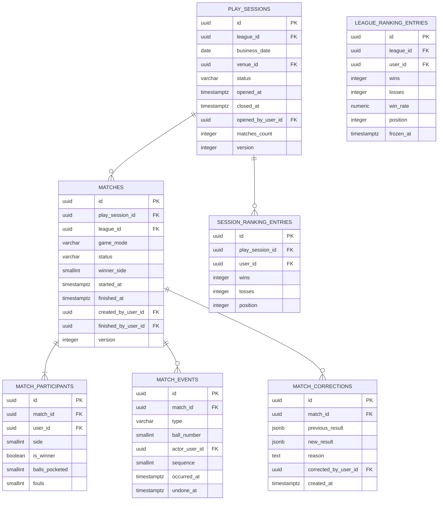

# 5. Modelo de dados

**SGBD alvo `[R]`:** PostgreSQL 16 (Azure Database for PostgreSQL Flexible Server) com extensões `uuid-ossp`/`pgcrypto`, `citext` (e-mail e username case-insensitive), `postgis` (busca por proximidade) e `pg_trgm` (busca textual de usuários, ligas e locais).

**Convenções globais `[R]`:**

| Convenção | Regra |
|---|---|
| Nomenclatura no banco | `snake_case`, tabelas no plural (`league_members`) |
| Nomenclatura na API | `camelCase` (`leagueId`) — mapeamento no adapter, nunca vazando `snake_case` |
| Chave primária | `uuid` gerado pela **aplicação** (UUID v7 quando disponível — ordenável por tempo, reduz fragmentação de índice; v4 aceitável) |
| Datas | `timestamptz` **sempre em UTC**; nunca `timestamp` sem fuso |
| Data de negócio | `date` puro (`business_date`) quando o conceito é "o dia da jogatina", não um instante |
| Dinheiro | `numeric(10,2)` + coluna de moeda (`char(3)`, default `BRL`) |
| Percentual | `numeric(5,2)` (0,00–100,00) — nunca `float` |
| Enums | `varchar` + `CHECK` (não `enum` nativo do Postgres: alterar valor de enum exige `ALTER TYPE` com lock) |
| Auditoria | `created_at`, `updated_at`, `created_by`, `updated_by` nas tabelas mutáveis |
| Soft delete | `deleted_at timestamptz NULL` + índices parciais `WHERE deleted_at IS NULL` |
| Optimistic locking | `version integer NOT NULL DEFAULT 1` nas raízes de agregado mutáveis |
| Texto livre | `text` (Postgres não penaliza), com `CHECK (length(...) BETWEEN a AND b)` |

---

## 5.1 Diagrama ER — visão geral

```mermaid
erDiagram
    USERS ||--o| USER_CREDENTIALS : "tem"
    USERS ||--o{ REFRESH_TOKENS : "possui sessões"
    USERS ||--o| USER_PROFILE_SETTINGS : "configura"
    USERS ||--o{ USER_DEVICES : "registra"
    USERS ||--o{ FRIEND_REQUESTS : "envia/recebe"
    USERS ||--o{ FRIENDSHIPS : "participa"
    USERS ||--o{ LEAGUE_MEMBERS : "é membro"
    USERS ||--o{ LEAGUE_INVITATIONS : "convida/é convidado"
    USERS ||--o{ PLAY_SESSION_PARTICIPANTS : "comparece"
    USERS ||--o{ MATCH_PARTICIPANTS : "joga"
    USERS ||--o{ MATCH_EVENTS : "executa"
    USERS ||--o{ NOTIFICATIONS : "recebe"
    USERS ||--o| USER_STATISTICS : "acumula"
    USERS ||--o{ USER_DAILY_STATS : "acumula por dia"
    USERS ||--o{ HEAD_TO_HEAD_STATS : "confronta"
    USERS ||--o{ AUDIT_LOGS : "origina"

    VENUES ||--o{ VENUE_OPENING_HOURS : "abre em"
    VENUES ||--o{ LEAGUES : "sedia"

    LEAGUES ||--|| LEAGUE_RULES : "rege-se por"
    LEAGUES ||--|| LEAGUE_SCHEDULES : "agenda"
    LEAGUE_SCHEDULES ||--o{ LEAGUE_SCHEDULE_WEEKDAYS : "nos dias"
    LEAGUES ||--o{ LEAGUE_MEMBERS : "reúne"
    LEAGUES ||--o{ LEAGUE_INVITATIONS : "emite"
    LEAGUES ||--o{ LEAGUE_INVITE_CODES : "emite"
    LEAGUES ||--o{ PLAY_SESSIONS : "realiza"
    LEAGUES ||--o{ MATCHES : "contém"
    LEAGUES ||--o{ LEAGUE_RANKING_ENTRIES : "classifica"

    PLAY_SESSIONS ||--o{ PLAY_SESSION_PARTICIPANTS : "tem presentes"
    PLAY_SESSIONS ||--o{ MATCHES : "agrupa"
    PLAY_SESSIONS ||--o{ SESSION_RANKING_ENTRIES : "gera pódio"
    PLAY_SESSIONS ||--o{ SHARE_ARTIFACTS : "compartilha"

    MATCHES ||--|{ MATCH_PARTICIPANTS : "envolve"
    MATCHES ||--o{ MATCH_EVENTS : "registra"
    MATCHES ||--o{ MATCH_CORRECTIONS : "é corrigida por"
```



## 5.2 Diagrama ER — detalhe de identidade e social

```mermaid
erDiagram
    USERS {
        uuid id PK
        citext username UK
        citext email UK
        text display_name
        text avatar_url
        varchar status
        timestamptz email_verified_at
        timestamptz created_at
        timestamptz deleted_at
        integer version
    }
    USER_CREDENTIALS {
        uuid user_id PK-FK
        text password_hash
        varchar password_algo
        timestamptz password_changed_at
        smallint failed_attempts
        timestamptz locked_until
    }
    REFRESH_TOKENS {
        uuid id PK
        uuid user_id FK
        uuid session_id
        text token_hash UK
        uuid replaced_by_id FK
        timestamptz expires_at
        timestamptz revoked_at
        varchar revoked_reason
    }
    FRIEND_REQUESTS {
        uuid id PK
        uuid requester_id FK
        uuid addressee_id FK
        varchar status
        timestamptz created_at
        timestamptz responded_at
    }
    FRIENDSHIPS {
        uuid id PK
        uuid user_a_id FK
        uuid user_b_id FK
        uuid originating_request_id FK
        timestamptz created_at
        timestamptz deleted_at
    }
    USERS ||--o| USER_CREDENTIALS : ""
    USERS ||--o{ REFRESH_TOKENS : ""
    USERS ||--o{ FRIEND_REQUESTS : ""
    USERS ||--o{ FRIENDSHIPS : ""
    FRIEND_REQUESTS ||--o| FRIENDSHIPS : "origina"
```

## 5.3 Diagrama ER — detalhe de partida e ranking



---

## 5.4 Módulo Identity & Auth

### `users`

| Campo | Tipo | Obrig. | Default | Constraints / Índices | Descrição |
|---|---|:--:|---|---|---|
| `id` | uuid | ✔ | — | PK | Identidade global do jogador |
| `username` | citext | ✔ | — | `UNIQUE WHERE deleted_at IS NULL`; `CHECK (username ~ '^[a-z0-9_.]{3,20}$')`; índice GIN trigram | `@baroni` — exibido em toda a UI |
| `email` | citext | ✔ | — | `UNIQUE WHERE deleted_at IS NULL`; `CHECK` formato | Login e comunicação |
| `display_name` | text | ✔ | — | `CHECK (length BETWEEN 2 AND 60)`; índice GIN trigram | "Rodrigo Baroni" |
| `avatar_url` | text | ✖ | `NULL` | — | URL do CDN; `NULL` → app renderiza iniciais (`RB`) |
| `avatar_color` | varchar(7) | ✖ | derivado | `CHECK (~'^#[0-9A-Fa-f]{6}$')` | Cor de fundo das iniciais (mockup usa 5 cores) |
| `status` | varchar(20) | ✔ | `'PENDING_VERIFICATION'` | `CHECK IN ('PENDING_VERIFICATION','ACTIVE','DEACTIVATED','DELETION_SCHEDULED','ANONYMIZED')` | Ciclo de vida da conta |
| `email_verified_at` | timestamptz | ✖ | `NULL` | — | Preenchido pela verificação |
| `timezone` | varchar(64) | ✔ | `'America/Sao_Paulo'` | IANA | Fuso do usuário (agrupamentos de estatística) |
| `locale` | varchar(10) | ✔ | `'pt-BR'` | — | Idioma de e-mails e notificações |
| `accepted_terms_version` | varchar(20) | ✔ | — | — | Versão dos termos aceita no cadastro (LGPD) |
| `accepted_terms_at` | timestamptz | ✔ | — | — | Prova de consentimento |
| `member_since` | date | ✔ | `CURRENT_DATE` | — | "Desde jan 2025" na Home |
| `last_seen_at` | timestamptz | ✖ | `NULL` | índice | Ordenação de busca e limpeza de contas inativas |
| `deletion_scheduled_at` | timestamptz | ✖ | `NULL` | índice parcial | Data-limite de anonimização (LGPD, D+30) |
| `created_at` / `updated_at` | timestamptz | ✔ | `now()` | — | Auditoria |
| `deleted_at` | timestamptz | ✖ | `NULL` | — | Soft delete |
| `version` | integer | ✔ | `1` | — | Optimistic locking |

**Índices:** `ix_users_username_trgm (username gin_trgm_ops)`, `ix_users_display_name_trgm`, `ix_users_status`, `ux_users_email_active`, `ux_users_username_active`.

### `user_credentials`

| Campo | Tipo | Obrig. | Default | Constraints | Descrição |
|---|---|:--:|---|---|---|
| `user_id` | uuid | ✔ | — | PK, FK → `users(id)` ON DELETE CASCADE | 1:1 com usuário |
| `password_hash` | text | ✔ | — | — | **Argon2id** (`m=19456 KiB, t=2, p=1`) |
| `password_algo` | varchar(20) | ✔ | `'argon2id'` | `CHECK IN ('argon2id','bcrypt')` | Permite rehash progressivo |
| `password_changed_at` | timestamptz | ✔ | `now()` | — | Base para "trocou senha → revogar sessões" |
| `failed_attempts` | smallint | ✔ | `0` | `CHECK (>= 0)` | Contador de tentativas |
| `locked_until` | timestamptz | ✖ | `NULL` | — | Bloqueio temporário (10 falhas → 15 min) |
| `previous_hashes` | text[] | ✖ | `'{}'` | `CHECK (array_length <= 3)` | Impede reutilizar as 3 últimas senhas `[R]` |

> Separada de `users` `[R]`: nenhuma consulta de perfil, ranking ou busca deve tocar em tabela que contém hash de senha. Facilita `GRANT` restritivo e evita vazamento acidental por `SELECT *`.

### `refresh_tokens`

| Campo | Tipo | Obrig. | Default | Constraints | Descrição |
|---|---|:--:|---|---|---|
| `id` | uuid | ✔ | — | PK | |
| `user_id` | uuid | ✔ | — | FK → `users`; índice | |
| `session_id` | uuid | ✔ | — | índice | **Família** de tokens = 1 dispositivo/login. Vai no claim `sid` |
| `token_hash` | text | ✔ | — | `UNIQUE` | SHA-256 do token; o valor cru **nunca** é persistido |
| `replaced_by_id` | uuid | ✖ | `NULL` | FK → `refresh_tokens` | Cadeia de rotação (detecta reuso) |
| `issued_at` | timestamptz | ✔ | `now()` | — | |
| `expires_at` | timestamptz | ✔ | — | índice | 30 dias `[R]` |
| `revoked_at` | timestamptz | ✖ | `NULL` | — | |
| `revoked_reason` | varchar(30) | ✖ | `NULL` | `CHECK IN ('LOGOUT','ROTATED','REUSE_DETECTED','PASSWORD_CHANGED','ADMIN','ACCOUNT_DELETED')` | |
| `device_name` | text | ✖ | `NULL` | — | "iPhone 15 de Rodrigo" — tela de sessões (pós-MVP) |
| `ip_address` | inet | ✖ | `NULL` | — | Retenção de 90 dias; anonimizada depois |
| `user_agent` | text | ✖ | `NULL` | — | |

**Detecção de reuso:** apresentar um token já `ROTATED` → revogar **toda a família** (`session_id`), emitir `SuspiciousRefreshDetected`, exigir novo login.

### `email_verification_tokens` / `password_reset_tokens`

| Campo | Tipo | Obrig. | Default | Constraints | Descrição |
|---|---|:--:|---|---|---|
| `id` | uuid | ✔ | — | PK | |
| `user_id` | uuid | ✔ | — | FK; índice | |
| `token_hash` | text | ✔ | — | `UNIQUE` | Somente hash |
| `expires_at` | timestamptz | ✔ | — | — | Verificação: 24 h · Reset: **30 min** |
| `used_at` | timestamptz | ✖ | `NULL` | — | Uso único |
| `requested_ip` | inet | ✖ | `NULL` | — | Antiabuso |
| `created_at` | timestamptz | ✔ | `now()` | — | |

### `login_attempts` `[R]`

| Campo | Tipo | Obrig. | Descrição |
|---|---|:--:|---|
| `id` | bigserial | ✔ | PK |
| `email_hash` | text | ✔ | SHA-256 do e-mail tentado (não guarda e-mail inválido em claro) |
| `ip_hash` | text | ✔ | Hash com salt rotativo |
| `succeeded` | boolean | ✔ | |
| `occurred_at` | timestamptz | ✔ | Índice BRIN; partição mensal; retenção 90 dias |

---

## 5.5 Módulo Users

### `user_profile_settings`

| Campo | Tipo | Obrig. | Default | Constraints | Descrição |
|---|---|:--:|---|---|---|
| `user_id` | uuid | ✔ | — | PK, FK | |
| `profile_visibility` | varchar(20) | ✔ | `'FRIENDS_ONLY'` | `CHECK IN ('PUBLIC','FRIENDS_ONLY','PRIVATE')` | `DP-015` |
| `searchable_by_username` | boolean | ✔ | `true` | — | Permite ser achado na busca |
| `share_stats_publicly` | boolean | ✔ | `false` | — | Opt-in para aparecer em link público (`DP-004`) |
| `location_consent_at` | timestamptz | ✖ | `NULL` | — | Consentimento de geolocalização (LGPD) |
| `location_consent_version` | varchar(20) | ✖ | `NULL` | — | |
| `updated_at` | timestamptz | ✔ | `now()` | — | |

### `data_export_requests`

| Campo | Tipo | Obrig. | Default | Descrição |
|---|---|:--:|---|---|
| `id` | uuid | ✔ | — | PK |
| `user_id` | uuid | ✔ | — | FK; índice |
| `status` | varchar(20) | ✔ | `'PENDING'` | `PENDING, PROCESSING, READY, EXPIRED, FAILED` |
| `file_url` | text | ✖ | `NULL` | Blob com SAS de leitura, TTL 72 h |
| `requested_at` / `completed_at` / `expires_at` | timestamptz | — | — | |
| `downloaded_at` | timestamptz | ✖ | `NULL` | Auditoria LGPD |

---

## 5.6 Módulo Friendships

### `friend_requests`

| Campo | Tipo | Obrig. | Default | Constraints | Descrição |
|---|---|:--:|---|---|---|
| `id` | uuid | ✔ | — | PK | |
| `requester_id` | uuid | ✔ | — | FK → `users`; índice | Quem enviou |
| `addressee_id` | uuid | ✔ | — | FK → `users`; índice | Quem recebeu |
| `status` | varchar(20) | ✔ | `'PENDING'` | `CHECK IN ('PENDING','ACCEPTED','DECLINED','CANCELLED','EXPIRED')` | |
| `message` | text | ✖ | `NULL` | `CHECK (length <= 200)` | Pós-MVP |
| `created_at` | timestamptz | ✔ | `now()` | índice desc | "há 5 horas" |
| `responded_at` | timestamptz | ✖ | `NULL` | — | |
| `expires_at` | timestamptz | ✖ | `NULL` | — | `DP-019`: recomendação **sem expiração** para amizade |

**Constraints:**
- `CHECK (requester_id <> addressee_id)`
- `ux_friend_requests_pending UNIQUE (requester_id, addressee_id) WHERE status = 'PENDING'`
- Índice `ix_friend_requests_inbox (addressee_id, status, created_at DESC)` — alimenta a aba "Convites" e o badge.

### `friendships`

| Campo | Tipo | Obrig. | Default | Constraints | Descrição |
|---|---|:--:|---|---|---|
| `id` | uuid | ✔ | — | PK | |
| `user_a_id` | uuid | ✔ | — | FK; `CHECK (user_a_id < user_b_id)` | **Sempre o menor UUID** — garante unicidade simétrica |
| `user_b_id` | uuid | ✔ | — | FK | |
| `originating_request_id` | uuid | ✖ | `NULL` | FK → `friend_requests` | Rastreabilidade |
| `created_at` | timestamptz | ✔ | `now()` | — | "Amigos desde" |
| `deleted_at` | timestamptz | ✖ | `NULL` | — | Soft delete (remover amigo) |

**Constraints:** `ux_friendships_pair UNIQUE (user_a_id, user_b_id) WHERE deleted_at IS NULL`; índices `ix_friendships_a`, `ix_friendships_b`.
**Consulta de amigos:** `WHERE (user_a_id = :me OR user_b_id = :me) AND deleted_at IS NULL` — ou, melhor `[R]`, uma **view** `v_friend_edges` que devolve `(user_id, friend_id)` duplicando a linha nos dois sentidos, simplificando todo join a jusante.

### `user_blocks` (pós-MVP, `DP-022`)

| Campo | Tipo | Obrig. | Constraints | Descrição |
|---|---|:--:|---|---|
| `id` | uuid | ✔ | PK | |
| `blocker_id` | uuid | ✔ | FK | |
| `blocked_id` | uuid | ✔ | FK; `CHECK (<>)`; `UNIQUE (blocker_id, blocked_id)` | |
| `reason` | varchar(30) | ✖ | | `SPAM, HARASSMENT, OTHER` |
| `created_at` | timestamptz | ✔ | | |

---

## 5.7 Módulo Venues

### `venues`

| Campo | Tipo | Obrig. | Default | Constraints / Índices | Descrição |
|---|---|:--:|---|---|---|
| `id` | uuid | ✔ | — | PK | |
| `name` | text | ✔ | — | `CHECK (length 2..120)`; GIN trigram | "Bar do Zé" |
| `description` | text | ✖ | `NULL` | `length <= 1000` | |
| `photo_url` | text | ✖ | `NULL` | — | Capa do modal |
| `address_line` | text | ✔ | — | — | "R. Domingos de Morais, 1234" |
| `neighborhood` | text | ✖ | `NULL` | índice | "Vila Mariana" |
| `city` | text | ✔ | — | índice | "São Paulo" |
| `state` | char(2) | ✔ | — | `CHECK` UF válida | "SP" |
| `postal_code` | varchar(9) | ✖ | `NULL` | `CHECK (~'^\d{5}-?\d{3}$')` | CEP |
| `country` | char(2) | ✔ | `'BR'` | ISO 3166-1 | |
| `latitude` | numeric(9,6) | ✔ | — | `CHECK BETWEEN -90 AND 90` | |
| `longitude` | numeric(9,6) | ✔ | — | `CHECK BETWEEN -180 AND 180` | |
| `geo` | `geography(Point,4326)` | ✔ | gerado | **índice GIST** | Coluna gerada a partir de lat/lng; base do `ST_DWithin` |
| `price_per_hour` | numeric(10,2) | ✖ | `NULL` | `CHECK (>= 0)` | `30.00` |
| `currency` | char(3) | ✔ | `'BRL'` | — | |
| `rating` | numeric(2,1) | ✖ | `NULL` | `CHECK BETWEEN 0 AND 5` | `4.5` |
| `rating_count` | integer | ✔ | `0` | `CHECK (>= 0)` | `128` |
| `rating_source` | varchar(20) | ✔ | `'INTERNAL'` | `CHECK IN ('INTERNAL','GOOGLE_PLACES','MANUAL')` | `DP-017` / `DP-018` |
| `external_ref` | text | ✖ | `NULL` | `UNIQUE (rating_source, external_ref)` | `place_id` do provedor |
| `phone` | varchar(20) | ✖ | `NULL` | E.164 | |
| `tables_count` | smallint | ✖ | `NULL` | `CHECK (> 0)` | Quantas mesas de sinuca |
| `leagues_count` | integer | ✔ | `0` | — | Desnormalizado |
| `status` | varchar(20) | ✔ | `'ACTIVE'` | `CHECK IN ('ACTIVE','INACTIVE','PENDING_REVIEW')` | |
| `created_at` / `updated_at` / `deleted_at` | timestamptz | — | — | — | |
| `version` | integer | ✔ | `1` | — | |

### `venue_opening_hours`

| Campo | Tipo | Obrig. | Constraints | Descrição |
|---|---|:--:|---|---|
| `id` | uuid | ✔ | PK | |
| `venue_id` | uuid | ✔ | FK; índice | |
| `weekday` | smallint | ✔ | `CHECK BETWEEN 0 AND 6` (0=domingo) | |
| `opens_at` | time | ✔ | — | `20:00` |
| `closes_at` | time | ✔ | — | `04:00` (cruza a meia-noite quando `<= opens_at`) |
| `crosses_midnight` | boolean | ✔ | gerado: `closes_at <= opens_at` | Renderiza "Seg–Dom, 20h–04h" |

`UNIQUE (venue_id, weekday, opens_at)`.

---

## 5.8 Módulo Leagues

### `leagues`

| Campo | Tipo | Obrig. | Default | Constraints / Índices | Descrição |
|---|---|:--:|---|---|---|
| `id` | uuid | ✔ | — | PK | |
| `name` | text | ✔ | — | `CHECK (length 3..60)`; GIN trigram `WHERE visibility='PUBLIC'` | "Liga da Terça" |
| `description` | text | ✖ | `NULL` | `length <= 500` | |
| `owner_user_id` | uuid | ✔ | — | FK → `users`; índice | Dono (espelha `league_members.role='OWNER'`) |
| `venue_id` | uuid | ✖ | `NULL` | FK → `venues`; índice | Local; opcional (liga sem local fixo) |
| `venue_label` | text | ✖ | `NULL` | `length <= 120` | Local em texto livre quando não há `venue_id` `[R]` |
| `visibility` | varchar(10) | ✔ | `'PRIVATE'` | `CHECK IN ('PUBLIC','PRIVATE')` | |
| `status` | varchar(20) | ✔ | `'ACTIVE'` | `CHECK IN ('DRAFT','ACTIVE','FINISHED','ARCHIVED')` | |
| `game_mode` | varchar(20) | ✔ | `'ONE_VS_ONE'` | `CHECK IN ('ONE_VS_ONE','TEAM_2V2')` | Chips do wizard |
| `duration_type` | varchar(20) | ✔ | `'SIX_MONTHS'` | `CHECK IN ('ONE_DAY','SIX_MONTHS','UNLIMITED')` | Chips do wizard |
| `starts_at` | date | ✔ | `CURRENT_DATE` | — | |
| `ends_at` | date | ✖ | `NULL` | `CHECK (ends_at IS NULL OR ends_at >= starts_at)` | Derivado de `duration_type`; `NULL` se `UNLIMITED` |
| `members_count` | integer | ✔ | `1` | `CHECK (>= 0)` | Desnormalizado — card "5 amigos" |
| `matches_count` | integer | ✔ | `0` | `CHECK (>= 0)` | Desnormalizado — card "32 partidas" (`INC-02`) |
| `sessions_count` | integer | ✔ | `0` | — | |
| `last_activity_at` | timestamptz | ✖ | `NULL` | índice desc | Ordenação da Home |
| `next_session_at` | timestamptz | ✖ | `NULL` | índice | **Cache** de "Próxima: terça, 20h"; recalculado por job e ao alterar schedule |
| `rules_locked_at` | timestamptz | ✖ | `NULL` | — | Preenchido na 1ª partida finalizada (`DP-008`) |
| `finished_at` | timestamptz | ✖ | `NULL` | — | |
| `finished_by_user_id` | uuid | ✖ | `NULL` | FK | |
| `created_at` / `updated_at` / `deleted_at` | timestamptz | — | — | — | |
| `created_by` / `updated_by` | uuid | — | — | FK | |
| `version` | integer | ✔ | `1` | — | ETag |

**Índices:** `ix_leagues_owner`, `ix_leagues_venue`, `ix_leagues_public_search (visibility, status) INCLUDE (name)`, `ix_leagues_next_session (next_session_at) WHERE status='ACTIVE'`.

### `league_rules`

| Campo | Tipo | Obrig. | Default | Constraints | Descrição |
|---|---|:--:|---|---|---|
| `league_id` | uuid | ✔ | — | PK, FK | 1:1 |
| `track_pocketed_balls` | boolean | ✔ | `true` | — | "Marca bola caída?" (ON no wizard) |
| `track_fouls` | boolean | ✔ | `false` | — | "Marca falta?" (OFF no wizard — `INC-08`) |
| `balls_count` | smallint | ✔ | `8` | `CHECK IN (8, 15)` | Mockup mostra 8 bolas `[C]` |
| `require_opponent_confirmation` | boolean | ✔ | `false` | — | `DP-001` — coluna já existe, valor fixo `false` no MVP |
| `correction_window_hours` | smallint | ✔ | `24` | `CHECK BETWEEN 0 AND 720` | `DP-003` |
| `tiebreaker_order` | text[] | ✔ | `'{WIN_RATE,WINS,FEWER_LOSSES,HEAD_TO_HEAD,JOINED_AT}'` | — | `DP-009` |
| `min_matches_for_ranking` | smallint | ✔ | `0` | `CHECK (>= 0)` | Evita 100% com 1 jogo (opcional) |
| `updated_at` / `updated_by` | — | — | — | — | |

### `league_schedules`

| Campo | Tipo | Obrig. | Default | Constraints | Descrição |
|---|---|:--:|---|---|---|
| `league_id` | uuid | ✔ | — | PK, FK | 1:1 |
| `start_time` | time | ✔ | `'20:00'` | — | |
| `end_time` | time | ✔ | `'00:00'` | — | |
| `crosses_midnight` | boolean | ✔ | gerado `end_time <= start_time` | — | Base do `businessDate` |
| `timezone` | varchar(64) | ✔ | `'America/Sao_Paulo'` | IANA | |
| `reminder_minutes_before` | integer | ✔ | `60` | `CHECK BETWEEN 0 AND 1440` | Notificação "começa em 1 hora" `[C]` |

### `league_schedule_weekdays`

| Campo | Tipo | Obrig. | Constraints | Descrição |
|---|---|:--:|---|---|
| `league_id` | uuid | ✔ | PK(1), FK | |
| `weekday` | smallint | ✔ | PK(2), `CHECK BETWEEN 0 AND 6` | 0=domingo … 2=terça, 5=sexta |

> **Alternativa avaliada:** `smallint[]` em `league_schedules`. Tabela filha vence porque o job de lembretes faz `JOIN … WHERE weekday = :hoje+1` com índice, e um array exigiria `ANY()` sem índice eficiente em escala.

### `league_members`

| Campo | Tipo | Obrig. | Default | Constraints | Descrição |
|---|---|:--:|---|---|---|
| `id` | uuid | ✔ | — | PK | |
| `league_id` | uuid | ✔ | — | FK; índice | |
| `user_id` | uuid | ✔ | — | FK; índice | |
| `role` | varchar(10) | ✔ | `'PLAYER'` | `CHECK IN ('OWNER','ADMIN','PLAYER')` | |
| `status` | varchar(10) | ✔ | `'ACTIVE'` | `CHECK IN ('ACTIVE','LEFT','REMOVED')` | |
| `joined_at` | timestamptz | ✔ | `now()` | — | Desempate final do ranking |
| `left_at` | timestamptz | ✖ | `NULL` | — | |
| `joined_via` | varchar(20) | ✔ | `'INVITATION'` | `CHECK IN ('CREATOR','INVITATION','INVITE_CODE','PUBLIC_JOIN')` | Analítica de aquisição |
| `invitation_id` | uuid | ✖ | `NULL` | FK | Rastreabilidade |
| `nickname` | text | ✖ | `NULL` | `length <= 30` | Apelido dentro da liga (pós-MVP) |
| `version` | integer | ✔ | `1` | — | |

**Constraints:**
- `ux_league_members_active UNIQUE (league_id, user_id) WHERE status = 'ACTIVE'`
- `ux_league_single_owner UNIQUE (league_id) WHERE role = 'OWNER' AND status = 'ACTIVE'` ← garante **exatamente um dono** no nível do banco
- Índice `ix_league_members_user (user_id, status)` — alimenta "minhas ligas"

### `league_invitations`

| Campo | Tipo | Obrig. | Default | Constraints | Descrição |
|---|---|:--:|---|---|---|
| `id` | uuid | ✔ | — | PK | |
| `league_id` | uuid | ✔ | — | FK; índice | |
| `invited_user_id` | uuid | ✔ | — | FK; índice | Convite **nominal** |
| `invited_by_user_id` | uuid | ✔ | — | FK | "Convidado por Felipe Costa" |
| `status` | varchar(20) | ✔ | `'PENDING'` | `CHECK IN ('PENDING','ACCEPTED','DECLINED','REVOKED','EXPIRED')` | |
| `message` | text | ✖ | `NULL` | `length <= 200` | |
| `created_at` | timestamptz | ✔ | `now()` | índice desc | "há 2 dias" |
| `expires_at` | timestamptz | ✔ | `now() + 7 days` | índice | `DP-019` |
| `responded_at` | timestamptz | ✖ | `NULL` | — | |

`ux_league_invitations_pending UNIQUE (league_id, invited_user_id) WHERE status = 'PENDING'`.

### `league_invite_codes`

| Campo | Tipo | Obrig. | Default | Constraints | Descrição |
|---|---|:--:|---|---|---|
| `id` | uuid | ✔ | — | PK | |
| `league_id` | uuid | ✔ | — | FK; índice | |
| `code` | varchar(16) | ✔ | — | `UNIQUE`; `CHECK (~'^[A-Z0-9-]{6,16}$')` | `TERCA-7K9M` — legível ao telefone, sem `0/O/1/I` |
| `created_by_user_id` | uuid | ✔ | — | FK | |
| `max_uses` | integer | ✖ | `NULL` | `CHECK (> 0)` | `NULL` = ilimitado |
| `uses_count` | integer | ✔ | `0` | `CHECK (>= 0)` | |
| `expires_at` | timestamptz | ✖ | `now() + 7 days` | índice | |
| `revoked_at` | timestamptz | ✖ | `NULL` | — | Rotacionar código = revogar + criar |
| `created_at` | timestamptz | ✔ | `now()` | — | |

**Alfabeto do código `[R]`:** `ABCDEFGHJKLMNPQRSTUVWXYZ23456789` (32 símbolos, sem ambíguos). 8 caracteres = 40 bits ≈ 1,1 trilhão de combinações — inviável de adivinhar, e ainda assim ditável no grupo do WhatsApp.

---

## 5.9 Módulo Play Sessions

### `play_sessions`

| Campo | Tipo | Obrig. | Default | Constraints | Descrição |
|---|---|:--:|---|---|---|
| `id` | uuid | ✔ | — | PK | |
| `league_id` | uuid | ✔ | — | FK; índice | |
| `business_date` | date | ✔ | — | ver unique abaixo | **O dia da jogatina no fuso da liga** |
| `venue_id` | uuid | ✖ | `NULL` | FK | Snapshot do local (a liga pode mudar depois) |
| `status` | varchar(20) | ✔ | `'IN_PROGRESS'` | `CHECK IN ('SCHEDULED','IN_PROGRESS','CLOSED','CANCELLED')` | |
| `opened_at` | timestamptz | ✔ | `now()` | — | |
| `opened_by_user_id` | uuid | ✔ | — | FK | |
| `closed_at` | timestamptz | ✖ | `NULL` | — | |
| `closed_by_user_id` | uuid | ✖ | `NULL` | FK | `NULL` quando fechada por job |
| `closed_reason` | varchar(20) | ✖ | `NULL` | `CHECK IN ('MANUAL','AUTO_TIMEOUT','LEAGUE_FINISHED')` | |
| `matches_count` | integer | ✔ | `0` | — | |
| `participants_count` | integer | ✔ | `0` | — | |
| `notes` | text | ✖ | `NULL` | `length <= 500` | |
| `created_at` / `updated_at` | timestamptz | ✔ | `now()` | — | |
| `version` | integer | ✔ | `1` | — | |

**Constraints críticas:**
- `ux_play_sessions_league_date UNIQUE (league_id, business_date) WHERE status <> 'CANCELLED'` — impede duas jogatinas no mesmo dia da mesma liga (base da idempotência de "abrir jogatina")
- `ux_play_sessions_single_open UNIQUE (league_id) WHERE status = 'IN_PROGRESS'` — no máximo uma noite aberta por liga
- Índice `ix_play_sessions_league_date (league_id, business_date DESC)` — histórico e filtros

### `play_session_participants`

| Campo | Tipo | Obrig. | Default | Constraints | Descrição |
|---|---|:--:|---|---|---|
| `id` | uuid | ✔ | — | PK | |
| `play_session_id` | uuid | ✔ | — | FK; índice | |
| `user_id` | uuid | ✔ | — | FK; `UNIQUE (play_session_id, user_id)` | |
| `joined_at` | timestamptz | ✔ | `now()` | — | |
| `added_by_user_id` | uuid | ✖ | `NULL` | FK | |

> Populada **automaticamente** ao iniciar uma partida (todo participante de partida vira participante da jogatina) e manualmente por `POST /play-sessions/{id}/participants` (alguém que apareceu mas ainda não jogou — aparece no pódio com 0 vitórias, exatamente como "Anderson — 0 vitórias" no modal `[C]`).

---

## 5.10 Módulo Matches

### `matches`

| Campo | Tipo | Obrig. | Default | Constraints | Descrição |
|---|---|:--:|---|---|---|
| `id` | uuid | ✔ | — | PK | |
| `play_session_id` | uuid | ✔ | — | FK; índice | `DP-011`: obrigatório no MVP |
| `league_id` | uuid | ✔ | — | FK; índice | Desnormalizado (evita join em todo histórico) |
| `game_mode` | varchar(20) | ✔ | — | `CHECK IN ('ONE_VS_ONE','TEAM_2V2')` | **Snapshot** da regra no momento da partida |
| `rules_snapshot` | jsonb | ✔ | `'{}'` | — | Congela `trackPocketedBalls`, `trackFouls`, `ballsCount` — protege o histórico de mudança de regra |
| `status` | varchar(20) | ✔ | `'IN_PROGRESS'` | `CHECK IN ('IN_PROGRESS','FINISHED','CANCELLED')` | |
| `winner_side` | smallint | ✖ | `NULL` | `CHECK (winner_side IN (1,2))`; `CHECK (status='FINISHED') = (winner_side IS NOT NULL)` | Lado vencedor (suporta duplas) |
| `result_status` | varchar(20) | ✔ | `'ORIGINAL'` | `CHECK IN ('ORIGINAL','CORRECTED')` | Sinaliza "resultado corrigido" na UI |
| `started_at` | timestamptz | ✔ | `now()` | — | `21:47` |
| `finished_at` | timestamptz | ✖ | `NULL` | índice desc | `21:32` do histórico |
| `duration_seconds` | integer | ✖ | gerado | — | Estatística futura |
| `created_by_user_id` | uuid | ✔ | — | FK | Quem tocou em "Começar partida" |
| `finished_by_user_id` | uuid | ✖ | `NULL` | FK | Quem tocou em "Venceu/Perdeu" — **essencial** em disputa |
| `cancelled_by_user_id` | uuid | ✖ | `NULL` | FK | |
| `cancel_reason` | varchar(30) | ✖ | `NULL` | `CHECK IN ('ABANDONED','MISTAKE','SESSION_CLOSED','OTHER')` | |
| `idempotency_key` | uuid | ✖ | `NULL` | `UNIQUE` | Anti-duplicidade de criação |
| `created_at` / `updated_at` | timestamptz | ✔ | `now()` | — | |
| `version` | integer | ✔ | `1` | — | ETag / `If-Match` |

**Índices:** `ix_matches_session (play_session_id, started_at)`, `ix_matches_league_finished (league_id, finished_at DESC) WHERE status='FINISHED'`.

**Chave natural anti-duplicidade `[R]`:** além do `idempotency_key`, um índice parcial impede duas partidas simultâneas do mesmo jogador — implementado via `match_participants` (abaixo).

### `match_participants`

| Campo | Tipo | Obrig. | Default | Constraints | Descrição |
|---|---|:--:|---|---|---|
| `id` | uuid | ✔ | — | PK | |
| `match_id` | uuid | ✔ | — | FK ON DELETE CASCADE; índice | |
| `user_id` | uuid | ✔ | — | FK; `UNIQUE (match_id, user_id)` | Ninguém joga duas vezes na mesma partida |
| `side` | smallint | ✔ | — | `CHECK (side IN (1,2))` | Lado 1 / lado 2 (duplas: 2 usuários por lado) |
| `is_winner` | boolean | ✖ | `NULL` | — | Derivado de `winner_side`; materializado para consulta |
| `balls_pocketed` | smallint | ✔ | `0` | `CHECK (>= 0)` | Projeção de `match_events` |
| `fouls` | smallint | ✔ | `0` | `CHECK (>= 0)` | Projeção de `match_events` |
| `league_member_id` | uuid | ✖ | `NULL` | FK | Snapshot do vínculo |

**Índice-chave para estatística:** `ix_match_participants_user (user_id, is_winner) INCLUDE (match_id)` e `ix_match_participants_user_match (user_id, match_id)`.
**Índice anti-concorrência `[R]`:** `ux_participant_single_active_match UNIQUE (user_id) WHERE match_id IN (SELECT id FROM matches WHERE status='IN_PROGRESS')` não é expressável diretamente em Postgres; a invariante "1 partida em andamento por jogador" é garantida por **coluna denormalizada** `users.active_match_id uuid NULL UNIQUE` `[R]`, atualizada na mesma transação.

### `match_events`

| Campo | Tipo | Obrig. | Default | Constraints | Descrição |
|---|---|:--:|---|---|---|
| `id` | uuid | ✔ | — | PK | |
| `match_id` | uuid | ✔ | — | FK; índice | |
| `type` | varchar(20) | ✔ | — | `CHECK IN ('BALL_POCKETED','FOUL','TURN_CHANGE')` | `TURN_CHANGE` reservado |
| `ball_number` | smallint | ✖ | `NULL` | `CHECK (ball_number BETWEEN 1 AND 15)`; obrigatório se `type='BALL_POCKETED'` | 1–8 no MVP |
| `actor_user_id` | uuid | ✖ | `NULL` | FK | Quem encaçapou / cometeu a falta (`DP-014`) |
| `recorded_by_user_id` | uuid | ✔ | — | FK | Quem tocou na tela |
| `side` | smallint | ✖ | `NULL` | `CHECK IN (1,2)` | Lado creditado |
| `sequence` | integer | ✔ | — | `UNIQUE (match_id, sequence)` | Ordem determinística dos eventos |
| `occurred_at` | timestamptz | ✔ | `now()` | — | |
| `undone_at` | timestamptz | ✖ | `NULL` | — | Soft undo (toggle da bola) |
| `undone_by_user_id` | uuid | ✖ | `NULL` | FK | |
| `idempotency_key` | uuid | ✖ | `NULL` | `UNIQUE` | |
| `metadata` | jsonb | ✖ | `'{}'` | — | Extensão futura |

**Constraint que impede bola duplicada:**
`ux_match_events_ball_active UNIQUE (match_id, ball_number) WHERE type = 'BALL_POCKETED' AND undone_at IS NULL`
→ tocar duas vezes rápido na bola 3 gera `409 DUPLICATE_MATCH_EVENT` em vez de dois registros.

### `match_corrections`

| Campo | Tipo | Obrig. | Default | Constraints | Descrição |
|---|---|:--:|---|---|---|
| `id` | uuid | ✔ | — | PK | |
| `match_id` | uuid | ✔ | — | FK; índice | |
| `previous_result` | jsonb | ✔ | — | — | `{"winnerSide":1,"participants":[…]}` |
| `new_result` | jsonb | ✔ | — | — | |
| `reason` | text | ✔ | — | `CHECK (length 5..300)` | Obrigatório — é o que resolve a discussão |
| `corrected_by_user_id` | uuid | ✔ | — | FK | |
| `created_at` | timestamptz | ✔ | `now()` | — | |
| `ranking_rebuild_job_id` | uuid | ✖ | `NULL` | FK | Rastreia o reprocessamento |

---

## 5.11 Módulo Rankings e Statistics

### `league_ranking_entries`

| Campo | Tipo | Obrig. | Default | Constraints | Descrição |
|---|---|:--:|---|---|---|
| `id` | uuid | ✔ | — | PK | |
| `league_id` | uuid | ✔ | — | FK; `UNIQUE (league_id, user_id)` | |
| `user_id` | uuid | ✔ | — | FK | |
| `wins` | integer | ✔ | `0` | `CHECK (>= 0)` | Coluna "V" |
| `losses` | integer | ✔ | `0` | `CHECK (>= 0)` | Coluna "D" |
| `matches_played` | integer | ✔ | `0` | gerado `wins + losses` | |
| `win_rate` | numeric(5,2) | ✔ | `0.00` | `CHECK BETWEEN 0 AND 100` | Coluna "%" — **valor exato**, arredondado só na exibição |
| `position` | integer | ✖ | `NULL` | índice | Coluna "#" |
| `previous_position` | integer | ✖ | `NULL` | — | Setinha de subiu/desceu (pós-MVP) |
| `current_win_streak` | integer | ✔ | `0` | — | |
| `longest_win_streak` | integer | ✔ | `0` | — | |
| `last_match_at` | timestamptz | ✖ | `NULL` | — | |
| `frozen_at` | timestamptz | ✖ | `NULL` | — | Ranking final da liga encerrada |
| `updated_at` | timestamptz | ✔ | `now()` | — | |
| `version` | integer | ✔ | `1` | — | |

Índice de leitura: `ix_league_ranking_order (league_id, position)`.

### `session_ranking_entries`

| Campo | Tipo | Obrig. | Default | Descrição |
|---|---|:--:|---|---|
| `id` | uuid | ✔ | — | PK |
| `play_session_id` | uuid | ✔ | — | FK; `UNIQUE (play_session_id, user_id)` |
| `user_id` | uuid | ✔ | — | FK |
| `wins` | integer | ✔ | `0` | "4 vitórias" no pódio |
| `losses` | integer | ✔ | `0` | |
| `position` | integer | ✖ | `NULL` | 🥇🥈🥉 |
| `updated_at` | timestamptz | ✔ | `now()` | |

### `user_statistics`

| Campo | Tipo | Obrig. | Default | Descrição |
|---|---|:--:|---|---|
| `user_id` | uuid | ✔ | — | PK, FK |
| `matches_played` | integer | ✔ | `0` | KPI "47" |
| `wins` | integer | ✔ | `0` | |
| `losses` | integer | ✔ | `0` | |
| `win_rate` | numeric(5,2) | ✔ | `0.00` | KPI "62%" |
| `current_win_streak` | integer | ✔ | `0` | KPI "Vitórias consecutivas: 5" |
| `longest_win_streak` | integer | ✔ | `0` | |
| `current_loss_streak` | integer | ✔ | `0` | |
| `longest_loss_streak` | integer | ✔ | `0` | KPI "Maiores derrotas: 2" `[I]` |
| `sessions_played` | integer | ✔ | `0` | |
| `podium_firsts` | integer | ✔ | `0` | Quantas noites terminou em 1º |
| `balls_pocketed_total` | integer | ✔ | `0` | |
| `last_match_at` | timestamptz | ✖ | `NULL` | |
| `recomputed_at` | timestamptz | ✔ | `now()` | Verificação de deriva |
| `version` | integer | ✔ | `1` | |

> **Interpretação de "Maiores derrotas: 2"** `[P]` `DP-016b`: o rótulo é ambíguo. Alternativas: (a) **maior sequência de derrotas** — leitura mais provável, simétrica ao KPI ao lado; (b) derrotas no período; (c) número de derrotas para o adversário que mais te venceu. **Recomendação: (a)**, campo `longestLossStreak`, e sugerir ao design renomear para "Maior sequência de derrotas".

### `user_daily_stats`

| Campo | Tipo | Obrig. | Default | Descrição |
|---|---|:--:|---|---|
| `user_id` | uuid | ✔ | — | PK(1), FK |
| `stat_date` | date | ✔ | — | PK(2) — data no fuso do **usuário** |
| `wins` | integer | ✔ | `0` | Barra azul do gráfico semanal |
| `losses` | integer | ✔ | `0` | Barra cinza |
| `matches_played` | integer | ✔ | gerado | |
| `cumulative_win_rate` | numeric(5,2) | ✖ | `NULL` | Linha do gráfico de 30 dias |
| `updated_at` | timestamptz | ✔ | `now()` | |

Índice: `ix_user_daily_stats (user_id, stat_date DESC)`. Retenção: 24 meses, depois agregação mensal.

### `head_to_head_stats`

| Campo | Tipo | Obrig. | Default | Descrição |
|---|---|:--:|---|---|
| `id` | uuid | ✔ | — | PK |
| `user_a_id` | uuid | ✔ | — | `CHECK (user_a_id < user_b_id)`; `UNIQUE (user_a_id, user_b_id, league_id)` |
| `user_b_id` | uuid | ✔ | — | |
| `league_id` | uuid | ✖ | `NULL` | `NULL` = agregado de **todas** as ligas (linha "Todas as ligas" do filtro) |
| `a_wins` | integer | ✔ | `0` | "Você 5" |
| `b_wins` | integer | ✔ | `0` | "João 3" |
| `total_matches` | integer | ✔ | gerado | |
| `last_match_at` | timestamptz | ✖ | `NULL` | |
| `updated_at` | timestamptz | ✔ | `now()` | |

> **Materialização condicional `[R]`:** manter uma linha por par **por liga** + uma linha global cresce com O(pares × ligas). Com < 50 mil usuários e grupos de 5–10 pessoas isso é irrisório (dezenas de linhas por usuário). Se o custo surpreender, o fallback é calcular o h2h por agregação em `match_participants` com o índice `(user_id, match_id)` — a consulta é um self-join em ~50 linhas.
> O filtro de **período** (30/90 dias) **não** é materializado: sempre agrega de `match_participants` filtrando `finished_at`.

---

## 5.12 Módulos Notifications, Sharing, Audit e transversais

### `notifications`

| Campo | Tipo | Obrig. | Default | Constraints | Descrição |
|---|---|:--:|---|---|---|
| `id` | uuid | ✔ | — | PK | |
| `user_id` | uuid | ✔ | — | FK; índice | Destinatário |
| `category` | varchar(30) | ✔ | — | `CHECK IN ('LEAGUE_INVITATIONS','FRIEND_REQUESTS','SESSION_ALERTS','MATCH_RESULTS','LEAGUE_UPDATES','SYSTEM')` | Define a seção da tela `[C]` |
| `type` | varchar(50) | ✔ | — | ver §4.14 | |
| `title` | text | ✔ | — | `length <= 120` | "Liga do Churrasco te convidou" |
| `body` | text | ✖ | `NULL` | `length <= 300` | |
| `payload` | jsonb | ✔ | `'{}'` | — | `{"invitationId":"…","leagueId":"…"}` — alimenta as ações inline |
| `actions` | jsonb | ✔ | `'[]'` | — | `[{"key":"ACCEPT","label":"Aceitar","style":"PRIMARY"}, …]` |
| `deep_link` | text | ✖ | `NULL` | — | `encacapei://leagues/{id}` |
| `read_at` | timestamptz | ✖ | `NULL` | índice parcial `WHERE read_at IS NULL` | Contador de não lidas |
| `resolved_at` | timestamptz | ✖ | `NULL` | — | Ação já executada (some o botão) |
| `dedupe_key` | text | ✖ | `NULL` | `UNIQUE (user_id, dedupe_key)` | Impede notificação duplicada em reprocessamento |
| `expires_at` | timestamptz | ✖ | `NULL` | — | Lembrete de jogatina expira após a noite |
| `created_at` | timestamptz | ✔ | `now()` | índice desc | "há 2 horas" |
| `deleted_at` | timestamptz | ✖ | `NULL` | — | "Limpar histórico" |

Índice principal: `ix_notifications_inbox (user_id, deleted_at, created_at DESC)`; contador: `ix_notifications_unread (user_id) WHERE read_at IS NULL AND deleted_at IS NULL`.
Particionamento: por mês em `created_at` quando ultrapassar ~50 M linhas.

### `notification_preferences`

| Campo | Tipo | Obrig. | Default | Descrição |
|---|---|:--:|---|---|
| `user_id` | uuid | ✔ | — | PK(1), FK |
| `category` | varchar(30) | ✔ | — | PK(2) |
| `in_app_enabled` | boolean | ✔ | `true` | |
| `push_enabled` | boolean | ✔ | `true` | |
| `email_enabled` | boolean | ✔ | `false` | Só `SYSTEM` e segurança por default |
| `quiet_hours_start` / `quiet_hours_end` | time | ✖ | `NULL` | Não empurrar push às 3h `[R]` |
| `updated_at` | timestamptz | ✔ | `now()` | |

### `user_devices`

| Campo | Tipo | Obrig. | Default | Constraints | Descrição |
|---|---|:--:|---|---|---|
| `id` | uuid | ✔ | — | PK | |
| `user_id` | uuid | ✔ | — | FK; índice | |
| `push_token` | text | ✔ | — | `UNIQUE` | Token FCM/APNs |
| `platform` | varchar(10) | ✔ | — | `CHECK IN ('IOS','ANDROID','WEB')` | |
| `app_version` | varchar(20) | ✖ | `NULL` | — | |
| `os_version` | varchar(20) | ✖ | `NULL` | — | |
| `locale` | varchar(10) | ✖ | `NULL` | — | |
| `last_seen_at` | timestamptz | ✔ | `now()` | — | Limpeza de tokens mortos (>90 dias) |
| `disabled_at` | timestamptz | ✖ | `NULL` | — | Token rejeitado pelo provedor |

### `share_artifacts`

| Campo | Tipo | Obrig. | Default | Constraints | Descrição |
|---|---|:--:|---|---|---|
| `id` | uuid | ✔ | — | PK | |
| `play_session_id` | uuid | ✔ | — | FK; índice | |
| `created_by_user_id` | uuid | ✔ | — | FK | |
| `kind` | varchar(20) | ✔ | `'SESSION_PODIUM'` | `CHECK IN ('SESSION_PODIUM','LEAGUE_RANKING','MATCH_RESULT')` | |
| `format` | varchar(20) | ✔ | `'LINK'` | `CHECK IN ('LINK','IMAGE_STORY','IMAGE_SQUARE')` | Story 1080×1920 · Post 1080×1080 |
| `status` | varchar(20) | ✔ | `'PENDING'` | `CHECK IN ('PENDING','PROCESSING','READY','FAILED','REVOKED')` | |
| `public_token` | varchar(43) | ✔ | — | `UNIQUE` | 32 bytes base64url — opaco, não sequencial |
| `image_url` | text | ✖ | `NULL` | — | Blob/CDN |
| `snapshot` | jsonb | ✔ | — | — | **Congela** o pódio no momento do compartilhamento (correção posterior não altera o card já publicado) |
| `visibility_level` | varchar(20) | ✔ | `'MINIMAL'` | `CHECK IN ('MINIMAL','FULL')` | `DP-004` |
| `view_count` | integer | ✔ | `0` | — | |
| `expires_at` | timestamptz | ✔ | `now() + 30 days` | índice | |
| `revoked_at` | timestamptz | ✖ | `NULL` | — | |
| `failure_reason` | text | ✖ | `NULL` | — | |
| `created_at` | timestamptz | ✔ | `now()` | — | |

### `audit_logs`

| Campo | Tipo | Obrig. | Default | Constraints | Descrição |
|---|---|:--:|---|---|---|
| `id` | uuid | ✔ | — | PK | |
| `occurred_at` | timestamptz | ✔ | `now()` | índice BRIN; **chave de partição mensal** | |
| `actor_user_id` | uuid | ✖ | `NULL` | FK; índice | `NULL` quando é o sistema |
| `actor_type` | varchar(20) | ✔ | `'USER'` | `CHECK IN ('USER','SYSTEM','PLATFORM_ADMIN')` | |
| `action` | varchar(60) | ✔ | — | índice | `MATCH_RESULT_CORRECTED` |
| `resource_type` | varchar(40) | ✔ | — | índice composto com `resource_id` | `Match` |
| `resource_id` | uuid | ✔ | — | | |
| `league_id` | uuid | ✖ | `NULL` | índice | Facilita "auditoria desta liga" |
| `before_state` | jsonb | ✖ | `NULL` | — | Somente campos relevantes, **sem PII sensível** |
| `after_state` | jsonb | ✖ | `NULL` | — | |
| `reason` | text | ✖ | `NULL` | — | |
| `trace_id` | varchar(32) | ✖ | `NULL` | índice | Correlação com Application Insights |
| `ip_hash` | text | ✖ | `NULL` | — | |
| `user_agent` | text | ✖ | `NULL` | — | |

**Imutabilidade `[R]`:** `REVOKE UPDATE, DELETE ON audit_logs FROM app_user;` e trigger `BEFORE UPDATE OR DELETE` que levanta exceção. Retenção: 5 anos; partições antigas movidas para armazenamento frio.

### `outbox_messages`

| Campo | Tipo | Obrig. | Default | Descrição |
|---|---|:--:|---|---|
| `id` | uuid | ✔ | — | PK |
| `aggregate_type` / `aggregate_id` | varchar(40) / uuid | ✔ | — | Origem |
| `event_type` | varchar(60) | ✔ | — | `MatchFinished` |
| `payload` | jsonb | ✔ | — | Contrato de evento (§13) |
| `occurred_at` | timestamptz | ✔ | `now()` | |
| `available_at` | timestamptz | ✔ | `now()` | Backoff de retentativa |
| `processed_at` | timestamptz | ✖ | `NULL` | Índice parcial `WHERE processed_at IS NULL` |
| `attempts` | smallint | ✔ | `0` | |
| `last_error` | text | ✖ | `NULL` | |
| `dead_lettered_at` | timestamptz | ✖ | `NULL` | Após 8 tentativas |
| `trace_id` | varchar(32) | ✖ | `NULL` | |

### `idempotency_records`

| Campo | Tipo | Obrig. | Default | Descrição |
|---|---|:--:|---|---|
| `key` | uuid | ✔ | — | PK(1) — valor do header `Idempotency-Key` |
| `user_id` | uuid | ✔ | — | PK(2) — escopo por usuário (chave de um não colide com a de outro) |
| `endpoint` | varchar(120) | ✔ | — | `POST /api/v1/matches` |
| `request_hash` | char(64) | ✔ | — | SHA-256 do corpo canonicalizado |
| `status` | varchar(20) | ✔ | `'IN_PROGRESS'` | `IN_PROGRESS, COMPLETED, FAILED` |
| `response_status` | smallint | ✖ | `NULL` | |
| `response_body` | jsonb | ✖ | `NULL` | Replicada no retry |
| `resource_id` | uuid | ✖ | `NULL` | |
| `created_at` | timestamptz | ✔ | `now()` | |
| `expires_at` | timestamptz | ✔ | `now() + 24h` | Job de limpeza |

---

## 5.13 Entidades avaliadas e a decisão sobre cada uma

| Entidade sugerida | Decisão | Justificativa |
|---|---|---|
| `User` + `UserCredential` | **Separadas** | Isolamento de segredo; `SELECT *` de perfil nunca toca hash |
| `RefreshToken` vs `Session` | **Unificadas** em `refresh_tokens` com `session_id` | Sessão é a *família* de tokens rotacionados; tabela extra não agrega |
| `Friendship` + `FriendshipRequest` | **Separadas** | Amizade é não-direcionada; convite é direcionado (§4.4) |
| `League` + `LeagueRule` + `LeagueSchedule` | **Separadas** (1:1) | Schedule tem filha N (dias); regra tende a crescer e a ser versionada |
| `LeagueMember` | **Própria** | Base de toda autorização; precisa de índices e unicidade próprios |
| `LeagueInvitation` + `LeagueInviteCode` | **Separadas** | Nominal (1 destinatário, aceite) × código (N usos, sem destinatário) |
| `PlaySession` + `Match` | **Separadas** | Sessão é a unidade de pódio/compartilhamento; agrega N partidas |
| `MatchParticipant` | **Própria** | Habilita duplas e dá índice eficiente por jogador |
| `MatchEvent` | **Própria** (append-only) | Preserva autoria, ordem e reversibilidade |
| `MatchCorrection` | **Própria** | Correção é evento de negócio com motivo, não um `UPDATE` |
| `RankingEntry` | **Dividida** em `league_ranking_entries` + `session_ranking_entries` | Cardinalidade, ciclo de vida e campos diferentes (liga tem streak e congelamento; sessão não) |
| `UserStatistics` + `UserDailyStat` + `HeadToHeadStat` | **Separadas** | Snapshot × série temporal × matriz de pares — perfis de escrita e leitura distintos |
| `Notification` | **Própria** | — |
| `ShareArtifact` | **Própria** | Estado assíncrono + token público + snapshot |
| `AuditLog` | **Própria, particionada, imutável** | Requisito de compliance e de disputa |
| `Venue` + `VenueOpeningHours` | **Separadas** | Horário é N por dia da semana |
| `VenueReview` | **Não criada no MVP** | `DP-017` — nota provavelmente vem de terceiro |

---

## 5.14 Estratégia de versionamento e concorrência

| Mecanismo | Onde se aplica | Como funciona |
|---|---|---|
| **Optimistic locking** | `leagues`, `matches`, `play_sessions`, `league_members`, `league_ranking_entries`, `users` | Coluna `version`; `UPDATE … WHERE id = :id AND version = :v`; 0 linhas afetadas → `409 CONCURRENT_MODIFICATION` |
| **ETag / If-Match** | `PATCH /leagues/{id}`, `POST /matches/{id}/finish`, `POST /matches/{id}/corrections`, `POST /leagues/{id}/finish` | `ETag: W/"7"` no GET; `If-Match: W/"7"` obrigatório no PATCH/POST mutante; ausência → `428 PRECONDITION_REQUIRED` |
| **Unique parcial como lock de negócio** | `play_sessions`, `league_members`, `match_events`, `league_invitations` | O banco recusa o estado inválido mesmo com duas transações simultâneas |
| **Idempotency-Key** | Todos os POST que criam recurso ou mudam estado | Tabela `idempotency_records` (§5.12) |
| **Advisory lock** | `RebuildLeagueRanking` | `pg_advisory_xact_lock(hashtext('ranking:' || league_id))` — impede dois reprocessamentos concorrentes da mesma liga |
| **Isolation level** | Finalização de partida e atualização de ranking | `READ COMMITTED` + `SELECT … FOR UPDATE` nas linhas de ranking envolvidas, sempre na **mesma ordem** (por `user_id` crescente) para evitar deadlock |

## 5.15 Soft delete — política por tabela

| Tabela | Soft delete? | Observação |
|---|---|---|
| `users` | ✔ (`deleted_at` + `ANONYMIZED`) | Nunca hard delete: quebraria o histórico de partidas de terceiros. LGPD atendida por **anonimização** (§15) |
| `leagues` | ✔ | Hard delete só se `matches_count = 0` |
| `friendships` | ✔ | Permite auditoria e reenvio de convite |
| `notifications` | ✔ | "Limpar histórico" |
| `venues` | ✔ | Bar fechou; ligas antigas ainda referenciam |
| `matches`, `match_events` | ✖ | Nunca deletados: `CANCELLED` e `undone_at` cobrem os casos |
| `refresh_tokens`, `*_tokens` | ✖ | Hard delete por job após expiração |
| `audit_logs` | ✖ | Imutáveis |
