# 11. Estados e máquinas de estado

Toda transição aqui é **explícita**: origem, destino, quem pode executar, pré-condições, efeitos e evento publicado. Transições ausentes do diagrama são **proibidas** e retornam `409` com o código correspondente do [capítulo 10](10-catalogo-erros.md).

Implementação `[R]`: a transição vive no **método da entidade de domínio** (`Match.Finish(winnerSide, actor, clock)`), nunca num `switch` na camada de aplicação. O `CHECK` do banco é rede de segurança, não a regra.

---

## 11.1 Conta de usuário (`users.status`)

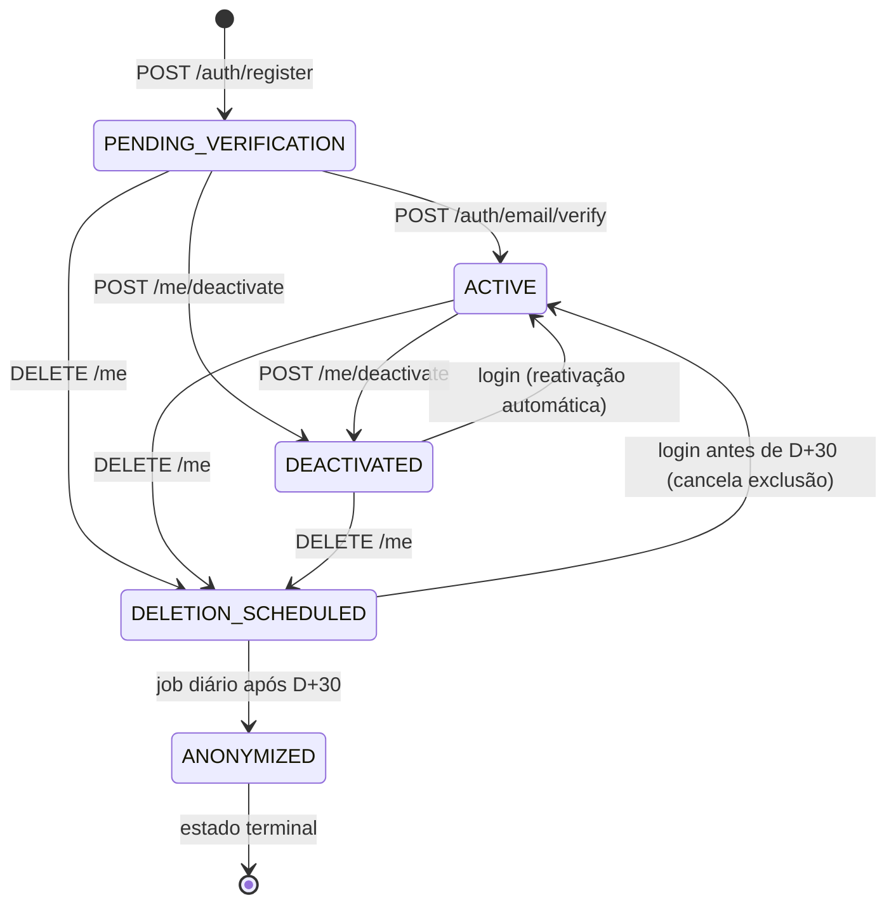

| De → Para | Quem | Pré-condições | Efeitos | Evento |
|---|---|---|---|---|
| — → `PENDING_VERIFICATION` | Visitante | Dados válidos, e-mail e username livres | Cria `User`, `UserCredential`, settings, stats, sessão | `UserRegistered` |
| `PENDING_VERIFICATION` → `ACTIVE` | Titular (token) | Token válido, ≤24 h, não usado | `emailVerifiedAt`; libera ações de RN-AUTH-008 | `EmailVerified` |
| `ACTIVE` → `DEACTIVATED` | Titular | Senha confere; não é `OWNER` de liga ativa com outros membros | Revoga sessões, sai das buscas, cancela convites enviados. **Mantém** ligas e histórico | `AccountDeactivated` |
| `DEACTIVATED` → `ACTIVE` | Titular | Login bem-sucedido | Reativação silenciosa (RN-USER-005) | `AccountReactivated` |
| qualquer → `DELETION_SCHEDULED` | Titular | Senha + confirmação textual | `deletionScheduledAt = now+30d`; revoga sessões | `AccountDeletionRequested` |
| `DELETION_SCHEDULED` → `ACTIVE` | Titular | Login dentro dos 30 dias | Cancela a exclusão | `AccountDeletionCancelled` |
| `DELETION_SCHEDULED` → `ANONYMIZED` | Sistema (job) | Passou D+30 | Anonimiza PII, **preserva `id` e histórico** (RN-USER-007) | `AccountAnonymized` |

**Terminalidade:** `ANONYMIZED` é irreversível. Nenhuma transição sai dele — nem por admin de plataforma.

---

## 11.2 Convite de amizade (`friend_requests.status`)

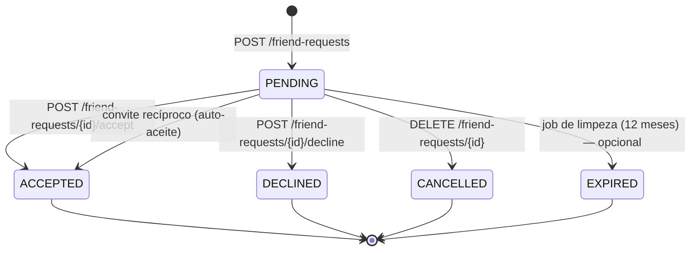

| De → Para | Quem | Pré-condições | Efeitos | Evento |
|---|---|---|---|---|
| — → `PENDING` | Qualquer usuário verificado | Não são amigos; sem convite pendente no mesmo sentido; alvo ≠ self; sem bloqueio | Cria request + notificação ao destinatário | `FriendRequestSent` |
| `PENDING` → `ACCEPTED` | **Destinatário** | Request pendente | Cria `Friendship` (`userA < userB`); resolve notificação; notifica remetente | `FriendRequestAccepted`, `FriendshipCreated` |
| `PENDING` → `ACCEPTED` (auto) | Sistema | Existe convite pendente no sentido inverso (RN-FRIEND-004) | Ambos os requests → `ACCEPTED`; cria amizade | idem |
| `PENDING` → `DECLINED` | **Destinatário** | Request pendente | Resolve notificação. **Não notifica** o remetente (RN-FRIEND-007) | `FriendRequestDeclined` |
| `PENDING` → `CANCELLED` | **Remetente** | Request pendente | Apaga (soft) a notificação do destinatário | `FriendRequestCancelled` |
| `PENDING` → `EXPIRED` | Sistema | 12 meses sem resposta (`DP-019`: recomendação é **não expirar**) | — | `FriendRequestExpired` |

> Após `ACCEPTED`/`DECLINED`, um novo convite é um **novo registro** — nunca reabre o antigo. Isso preserva a trilha de quantas vezes alguém tentou.

---

## 11.3 Amizade (`friendships`)

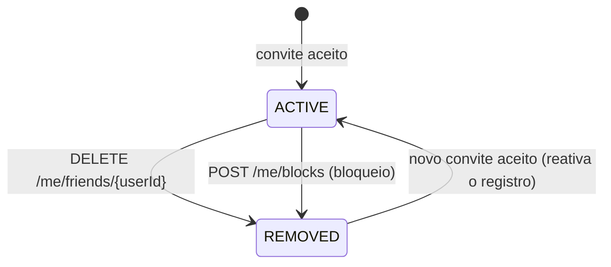

Modelada por `deleted_at` (não há coluna `status`): `ACTIVE` = `deleted_at IS NULL`.

| De → Para | Quem | Efeitos |
|---|---|---|
| — → `ACTIVE` | Sistema (ao aceitar convite) | Cria `Friendship` |
| `ACTIVE` → `REMOVED` | Qualquer um dos dois (unilateral) | Soft delete. **Não** remove de ligas, **não** apaga partidas, **não** notifica (RN-FRIEND-009) |
| `REMOVED` → `ACTIVE` | Sistema | Reaproveita o registro, limpando `deleted_at`; `createdAt` original é preservado como "amigos desde" a primeira vez `[R]` |

---

## 11.4 Liga (`leagues.status`)

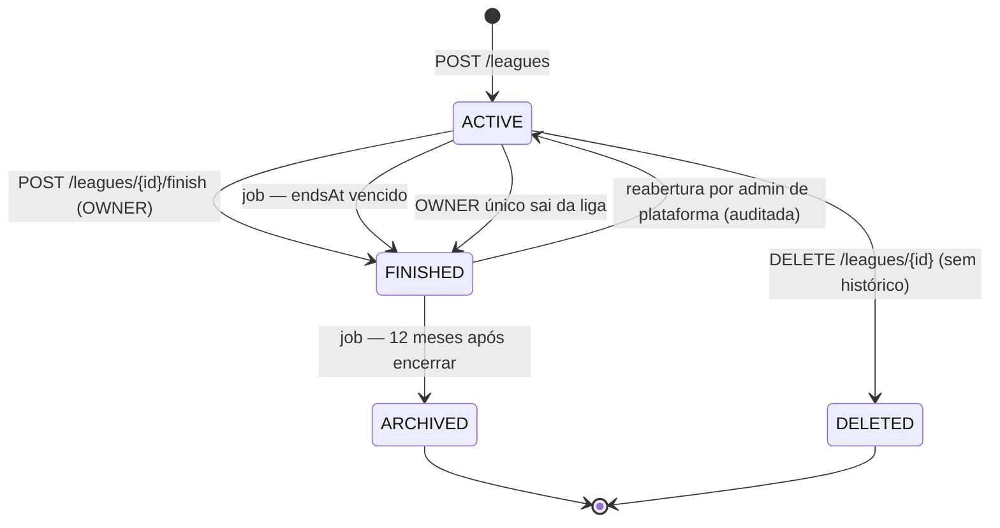

> O estado `DRAFT` existe no `CHECK` da tabela mas **não é usado no MVP**: o mockup cria a liga já ativa ("Criar liga" leva direto ao detalhe). Ele fica reservado para um wizard que salve rascunho entre sessões.

| De → Para | Quem | Pré-condições | Efeitos | Evento |
|---|---|---|---|---|
| — → `ACTIVE` | Usuário verificado | Payload válido | Cria liga + regra + schedule + `OWNER` + `RankingEntry`; se `ONE_DAY`, abre a jogatina do dia | `LeagueCreated` |
| `ACTIVE` → `FINISHED` | `OWNER` | Sem jogatina aberta (ou `force = true`) | Congela ranking (`frozenAt`); fecha jogatinas; cancela partidas; expira convites; revoga códigos; notifica membros | `LeagueFinished`, `RankingFrozen` |
| `ACTIVE` → `FINISHED` | Sistema (job diário 05:00 UTC) | `endsAt < hoje` | Idem, `closedReason` de sistema; notifica membros | `LeagueFinished` |
| `ACTIVE` → `FINISHED` | Sistema | `OWNER` era o único membro e saiu | Idem | `LeagueFinished` |
| `ACTIVE` → `DELETED` | `OWNER` | `matchesCount = 0` (RN-LEAGUE-012) | Soft delete | `LeagueDeleted` |
| `FINISHED` → `ARCHIVED` | Sistema | 12 meses após `finishedAt` | Sai das listagens padrão; leitura por ID continua | `LeagueArchived` |
| `FINISHED` → `ACTIVE` | Admin de plataforma | Motivo obrigatório | Descongela ranking; `AuditLog(PLATFORM_ADMIN_ACTION)` | `LeagueReopened` |

**O que `FINISHED` bloqueia** (RN-LEAGUE-010): criar jogatina, criar partida, registrar evento, convidar, gerar código, entrar, editar config.
**O que `FINISHED` permite:** leitura, sair da liga, correção dentro da janela (por admin da liga), compartilhamento do histórico.

---

## 11.5 Membro de liga (`league_members.status` × `role`)

Duas dimensões independentes. Primeiro o ciclo de vida:

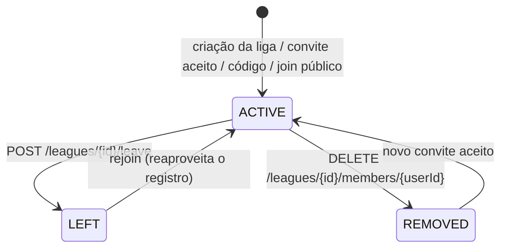

E o papel:

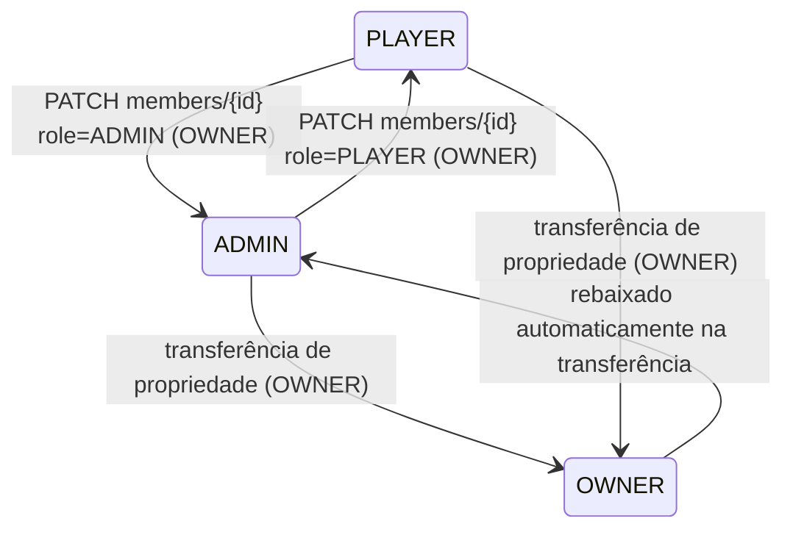

| De → Para | Quem | Pré-condições | Efeitos | Evento |
|---|---|---|---|---|
| — → `ACTIVE` | Sistema | Liga `ACTIVE`; não é membro ativo | Cria membro + `RankingEntry` zerada; `membersCount++` | `LeagueMemberJoined` |
| `ACTIVE` → `LEFT` | O próprio membro | Não é `OWNER` com outros membros; sem partida ativa | `membersCount--`; histórico preservado; `RankingEntry` marcada `inactive` (`DP-025`) | `LeagueMemberLeft` |
| `ACTIVE` → `REMOVED` | `ADMIN` (só `PLAYER`) ou `OWNER` (qualquer) | Alvo ≠ `OWNER`; sem partida ativa | Idem + notificação ao removido + `AuditLog` | `LeagueMemberRemoved` |
| `LEFT`/`REMOVED` → `ACTIVE` | Sistema | Novo ingresso | **Reaproveita** o registro, preservando `RankingEntry` (RN-MEMBER-008) | `LeagueMemberJoined` |
| `PLAYER` ↔ `ADMIN` | `OWNER` | Membro ativo | `AuditLog(ROLE_CHANGED)` + notificação | `LeagueMemberRoleChanged` |
| `*` → `OWNER` | `OWNER` atual | Alvo é membro ativo | **Transação atômica**: alvo → `OWNER`, dono atual → `ADMIN`; `leagues.owner_user_id` atualizado | `LeagueOwnershipTransferred` |

**Invariante garantida no banco:** `ux_league_single_owner UNIQUE (league_id) WHERE role='OWNER' AND status='ACTIVE'` — impossível existir liga com zero ou dois donos.

---

## 11.6 Convite de liga (`league_invitations.status`)

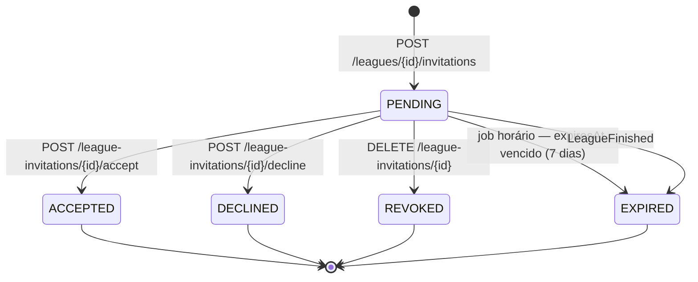

| De → Para | Quem | Pré-condições | Efeitos | Evento |
|---|---|---|---|---|
| — → `PENDING` | `ADMIN`/`OWNER` (ou `PLAYER` em liga pública — `DP-007`) | Liga `ACTIVE`; alvo não é membro; sem pendente para o par | Cria convite (`expiresAt = now+7d`) + notificação | `LeagueInvitationSent` |
| `PENDING` → `PENDING` (renovação) | Idem | Já existe pendente | **Renova** `expiresAt`; operação idempotente (RN-INVITE-003) | `LeagueInvitationSent` |
| `PENDING` → `ACCEPTED` | **Convidado** | Não expirado; liga `ACTIVE`; ainda não é membro | Cria `LeagueMember(PLAYER)` + `RankingEntry`; resolve notificação; notifica quem convidou | `LeagueInvitationAccepted`, `LeagueMemberJoined` |
| `PENDING` → `DECLINED` | **Convidado** | Não expirado | Resolve notificação; não notifica remetente | `LeagueInvitationDeclined` |
| `PENDING` → `REVOKED` | `ADMIN`/`OWNER` ou quem convidou | — | Apaga (soft) a notificação do convidado | `LeagueInvitationRevoked` |
| `PENDING` → `EXPIRED` | Sistema (job horário) | `expiresAt < now` | Notificação deixa de ser acionável | `LeagueInvitationExpired` |
| `PENDING` → `EXPIRED` | Sistema | Liga encerrada (RN-INVITE-011) | Idem | `LeagueInvitationExpired` |

## 11.7 Código de convite (`league_invite_codes`)

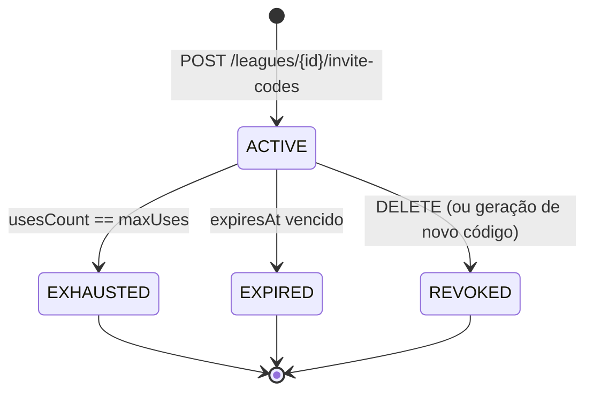

Estados derivados de `revoked_at`, `expires_at` e `uses_count`/`max_uses` — não há coluna `status` (evita desincronização entre coluna e realidade). Cada estado tem seu **próprio código de erro** para o app dar a mensagem certa (RN-INVITE-009).

---

## 11.8 Jogatina (`play_sessions.status`)

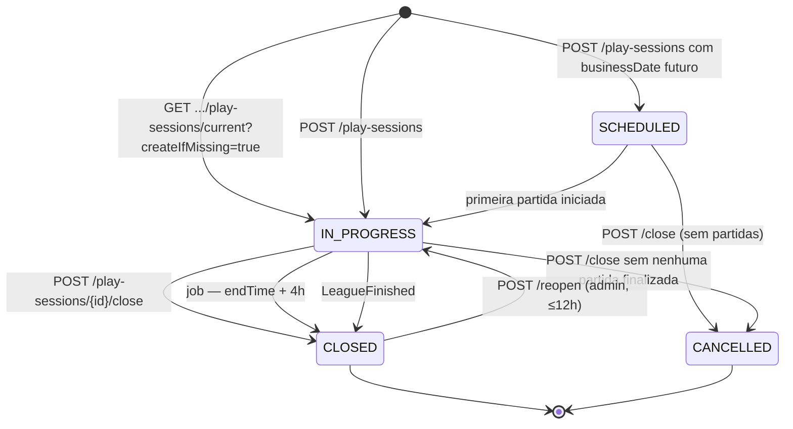

| De → Para | Quem | Pré-condições | Efeitos | Evento |
|---|---|---|---|---|
| — → `IN_PROGRESS` | Membro ativo | Liga `ACTIVE`; nenhuma jogatina aberta na liga; `(leagueId, businessDate)` livre | Cria jogatina + participante; `sessionsCount++`; agenda auto-close | `PlaySessionStarted` |
| — → `SCHEDULED` | Membro ativo | `businessDate` futuro | Jogatina pré-criada (uso opcional) | `PlaySessionScheduled` |
| `SCHEDULED` → `IN_PROGRESS` | Sistema | Primeira partida criada | — | `PlaySessionStarted` |
| `IN_PROGRESS` → `CLOSED` | `ADMIN`/`OWNER` ou quem abriu | Nenhuma partida `IN_PROGRESS` (ou `force = true`) | Congela pódio (`isFinal = true`); notifica participantes; recalcula `nextSessionAt`; opcionalmente gera card | `PlaySessionClosed` |
| `IN_PROGRESS` → `CLOSED` | Sistema (job 5 min) | `now > endTime + 4h` (RN-SESSION-009) | Idem, `closedReason = AUTO_TIMEOUT`; cancela partidas abertas | `PlaySessionClosed` |
| `IN_PROGRESS` → `CANCELLED` | Idem | **Zero** partidas finalizadas | Jogatina não entra no histórico nem no h2h | `PlaySessionCancelled` |
| `CLOSED` → `IN_PROGRESS` | `ADMIN`/`OWNER` | ≤12 h do fechamento; nenhuma outra aberta; motivo obrigatório | Descongela pódio; `AuditLog(SESSION_REOPENED)` | `PlaySessionReopened` |

**Invariantes de banco:** `ux_play_sessions_single_open UNIQUE (league_id) WHERE status='IN_PROGRESS'` e `ux_play_sessions_league_date UNIQUE (league_id, business_date) WHERE status <> 'CANCELLED'`.

---

## 11.9 Partida (`matches.status` + `result_status`)

**Avaliação do desenho sugerido no briefing** (`CREATED → IN_PROGRESS → FINISHED ↘ CANCELLED`, `FINISHED → CORRECTED`):

| Item do briefing | Decisão | Justificativa |
|---|---|---|
| Estado `CREATED` | **Removido** | O mockup vai de "Começar partida" direto para a tela de jogo (`[C]`); não existe partida criada e não iniciada. Um estado sem tela é estado morto |
| `FINISHED → CORRECTED` como **status** | **Recusado** | `CORRECTED` não é um estado do ciclo de vida: a partida continua finalizada e continua contando no ranking. Modelar como status obrigaria todo `WHERE status = 'FINISHED'` a virar `IN ('FINISHED','CORRECTED')` — bug garantido em algum agregado |
| Correção | **Segunda dimensão** (`result_status ∈ ORIGINAL \| CORRECTED`) | Consultas de agregação não mudam; a UI ainda consegue exibir o selo "resultado corrigido" |

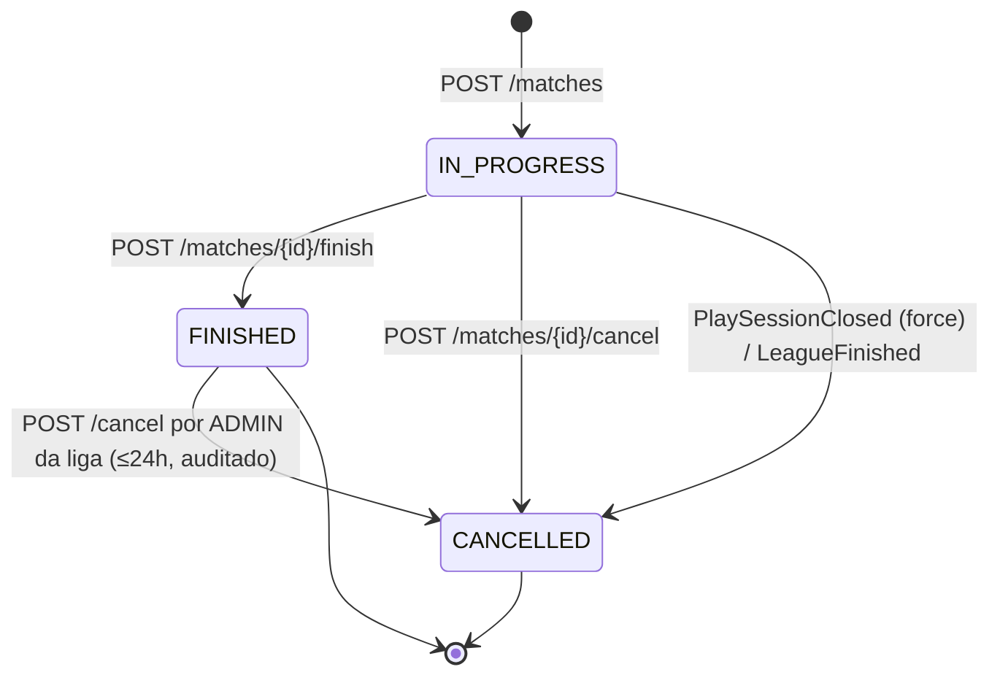

Dimensão de resultado, aplicável somente a `FINISHED`:

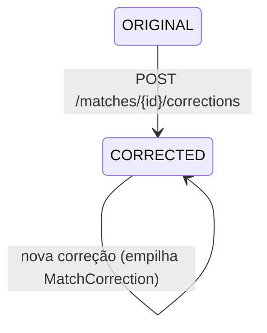

| De → Para | Quem | Pré-condições | Efeitos | Evento |
|---|---|---|---|---|
| — → `IN_PROGRESS` | Membro ativo da liga | Liga `ACTIVE`; jogatina `IN_PROGRESS`; 2 participantes válidos; nenhum deles em partida ativa | Cria partida + participantes; congela `rules_snapshot`; define `active_match_id`; `matchesCount++` na jogatina | `MatchStarted` |
| `IN_PROGRESS` → `FINISHED` | Participante ou `ADMIN`/`OWNER` | `If-Match` válido; `winnerSide` válido | **Transação:** `isWinner`, ranking da liga, ranking da jogatina, contadores, limpa `active_match_id`. **Assíncrono:** stats, h2h, notificação | `MatchFinished`, `RankingUpdated` |
| `IN_PROGRESS` → `CANCELLED` | Participante ou `ADMIN`/`OWNER` | `reason` válido | Eventos preservados; **não** afeta ranking; limpa `active_match_id`; `AuditLog` | `MatchCancelled` |
| `IN_PROGRESS` → `CANCELLED` | Sistema | Jogatina fechada com `force` ou liga encerrada | `cancelReason = SESSION_CLOSED` | `MatchCancelled` |
| `FINISHED` → `CANCELLED` | `ADMIN`/`OWNER` | ≤24 h de `finishedAt`; motivo obrigatório | **Reverte** o resultado do ranking (rebuild); `AuditLog` | `MatchCancelled`, `RankingRebuildRequested` |
| `ORIGINAL` → `CORRECTED` | Participante (≤24 h) ou `ADMIN`/`OWNER` | `FINISHED`; vencedor diferente; `reason` 5–300 | Cria `MatchCorrection`; troca `isWinner`; enfileira rebuild; notifica todos; `AuditLog` | `MatchResultCorrected`, `RankingRebuildRequested` |

**Transições proibidas e seus erros:**

| Tentativa | Erro |
|---|---|
| `FINISHED` → `FINISHED` (chave nova) | `409 MATCH_ALREADY_FINISHED` |
| `FINISHED` → `IN_PROGRESS` | Não existe. Para "voltar", cancele e crie nova partida |
| `CANCELLED` → qualquer | `409 MATCH_ALREADY_CANCELLED` |
| Evento em `FINISHED`/`CANCELLED` | `409 MATCH_NOT_IN_PROGRESS` |
| Correção em `IN_PROGRESS` | `409 MATCH_NOT_FINISHED` |

---

## 11.10 Evento de partida (`match_events`)

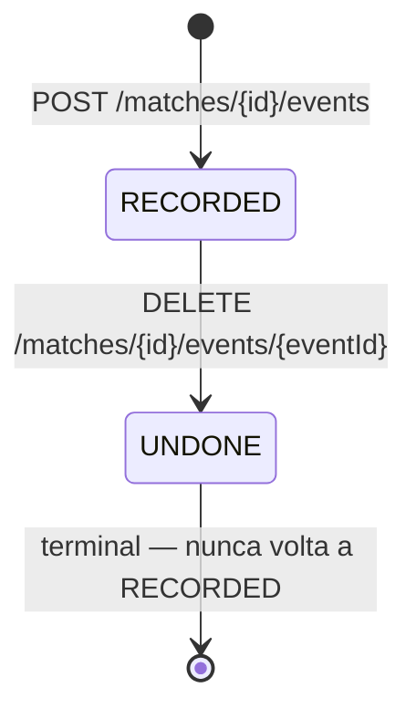

Derivado de `undone_at`. Um evento desfeito **não** é reativado: tocar na bola novamente cria um **novo** evento com nova `sequence`. Isso preserva a história completa ("encaçapou a 8, desfez, encaçapou de novo"), que é exatamente o que resolve discussão de mesa.

| De → Para | Quem | Pré-condições | Efeitos |
|---|---|---|---|
| — → `RECORDED` | Participante ou `ADMIN` | Partida `IN_PROGRESS`; tipo habilitado pela regra; bola livre | Incrementa contadores do participante; `sequence` monotônica |
| `RECORDED` → `UNDONE` | Participante ou `ADMIN` | Partida `IN_PROGRESS`; evento não desfeito | Decrementa contadores; libera a bola; `AuditLog` |

---

## 11.11 Artefato de compartilhamento (`share_artifacts.status`)

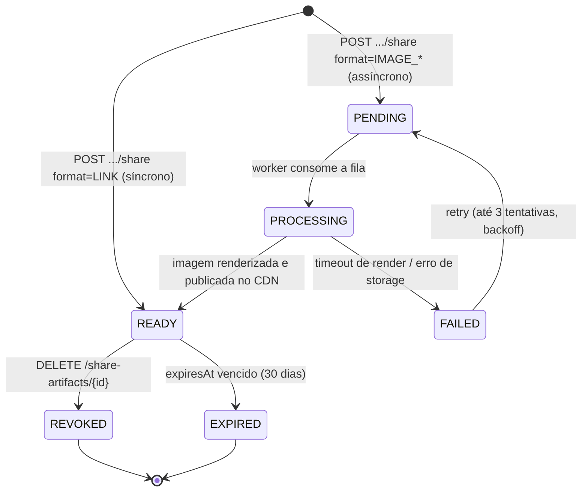

| De → Para | Quem | Pré-condições | Efeitos | Evento |
|---|---|---|---|---|
| — → `READY` | Participante da jogatina | Jogatina com ≥1 partida finalizada; `format = LINK` | Congela `snapshot` do pódio; gera `publicToken` (32 bytes) | `ShareArtifactRequested`, `ShareArtifactReady` |
| — → `PENDING` | Idem, `format = IMAGE_*` | Feature habilitada | Enfileira render | `ShareArtifactRequested` |
| `PENDING` → `PROCESSING` | Worker | — | — | — |
| `PROCESSING` → `READY` | Worker | Render OK | Publica no CDN; `imageUrl` | `ShareArtifactReady` |
| `PROCESSING` → `FAILED` | Worker | Timeout (>30 s) ou erro | `failureReason`; `retryable` | `ShareArtifactFailed` |
| `FAILED` → `PENDING` | Worker | < 3 tentativas | Backoff 5 s / 30 s / 2 min | — |
| `READY` → `REVOKED` | Criador ou `ADMIN` da liga | — | Link passa a `410`; imagem removida do CDN; `AuditLog` | `ShareRevoked` |
| `READY` → `EXPIRED` | Sistema | `expiresAt < now` | Link passa a `410`; imagem removida no expurgo semanal | `ShareExpired` |

**Ponto de projeto `[R]`:** o `snapshot` é congelado no momento **da criação**, não da leitura. Uma correção de resultado posterior **não** altera um card já enviado ao grupo do WhatsApp — o que evita a situação absurda de o link contar uma história diferente da que as pessoas viram.

---

## 11.12 Notificação (`notifications`)

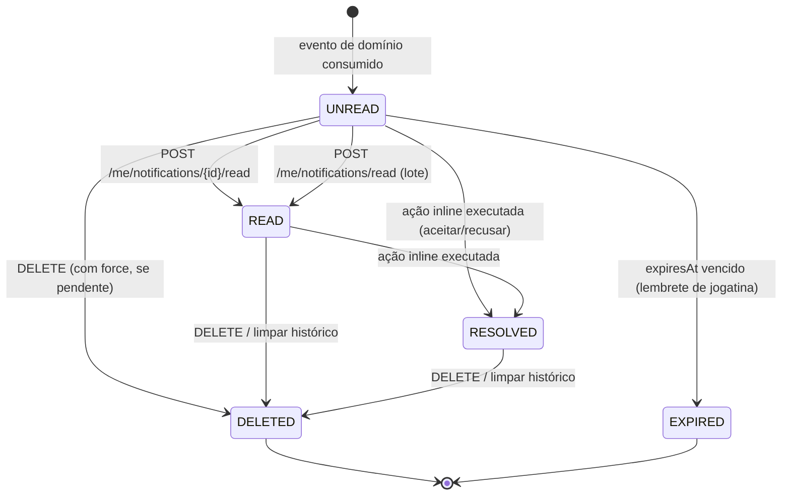

Derivado de `read_at`, `resolved_at`, `deleted_at` e `expires_at`.

| Transição | Gatilho | Observação |
|---|---|---|
| — → `UNREAD` | Handler de evento cria a notificação | Deduplicada por `dedupe_key` (RN-NOTIF-006) |
| `UNREAD` → `READ` | Usuário marca (individual ou lote) | Invalida o cache do contador |
| `*` → `RESOLVED` | Convite aceito/recusado, jogatina começou | Botões inline desaparecem (RN-NOTIF-004) |
| `READ`/`RESOLVED` → `DELETED` | "Limpar histórico" (`scope=READ`) | Pendentes acionáveis **sobrevivem** (RN-NOTIF-005) |
| `UNREAD` → `DELETED` | `DELETE` explícito | Bloqueado com `409 NOTIFICATION_HAS_PENDING_ACTION` sem `force=true` |
| `UNREAD` → `EXPIRED` | Job | Lembrete expira quando a jogatina começa (RN-NOTIF-011) |

---

## 11.13 Job de reprocessamento de ranking (`ranking_rebuild_jobs.status`)

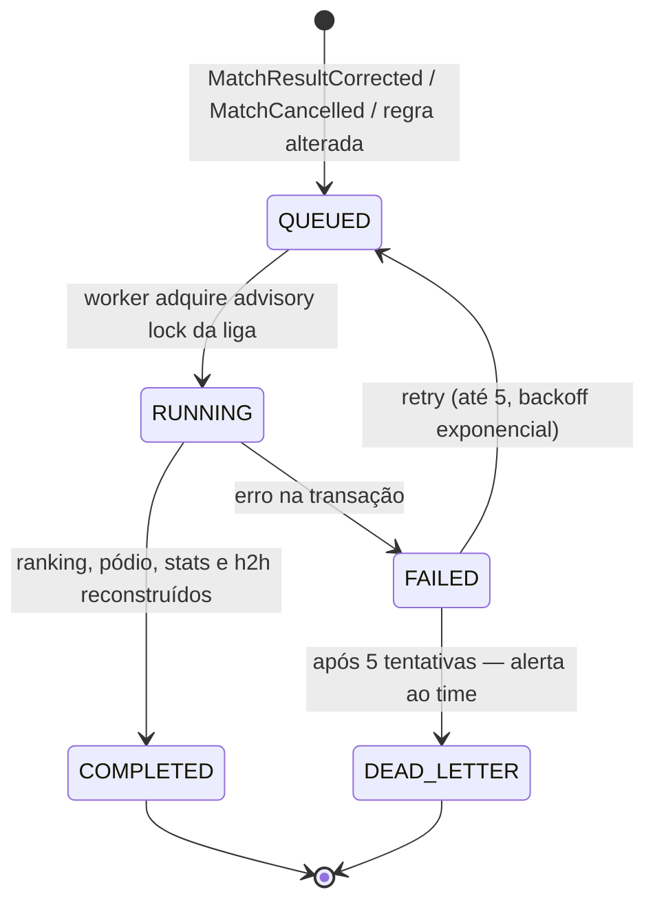

| Transição | Detalhes |
|---|---|
| — → `QUEUED` | Gravado no outbox na **mesma transação** da correção — se a correção commitou, o rebuild acontece |
| `QUEUED` → `RUNNING` | `pg_advisory_xact_lock(hashtext('ranking:' || league_id))` impede dois rebuilds concorrentes da mesma liga (RN-CONC-004) |
| `RUNNING` → `COMPLETED` | Recalcula **de forma determinística** a partir de `matches`; registra `positionChanges[]`; `AuditLog(RANKING_REBUILT)` |
| `FAILED` → `DEAD_LETTER` | Alerta com severidade alta: ranking divergente é o pior bug possível neste produto |

---

## 11.14 Resumo das invariantes protegidas pelo banco

| Invariante | Mecanismo |
|---|---|
| 1 dono por liga | `ux_league_single_owner` (unique parcial) |
| 1 membro ativo por (liga, usuário) | `ux_league_members_active` |
| 1 jogatina aberta por liga | `ux_play_sessions_single_open` |
| 1 jogatina por (liga, data) | `ux_play_sessions_league_date` |
| 1 partida ativa por jogador | `users.active_match_id` unique |
| Bola não encaçapada duas vezes | `ux_match_events_ball_active` |
| 1 convite pendente por (liga, convidado) | `ux_league_invitations_pending` |
| 1 convite de amizade pendente por par | `ux_friend_requests_pending` |
| Amizade única e simétrica | `CHECK (user_a_id < user_b_id)` + unique |
| `winnerSide` presente se e só se `FINISHED` | `CHECK ((status='FINISHED') = (winner_side IS NOT NULL))` |
| Código de convite único | `UNIQUE (code)` |
| Token público único | `UNIQUE (public_token)` |
