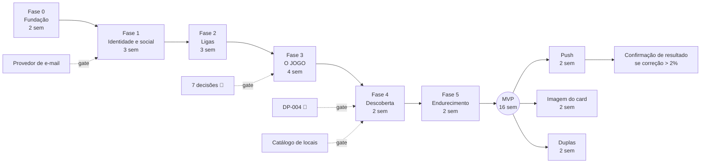

# 20. Roadmap técnico

Sequenciamento por **dependência técnica e de decisão**, não por área funcional. O critério de ordenação é: *o que desbloqueia mais coisas e depende de menos decisões pendentes vem primeiro.*

Premissa de time: **2 desenvolvedores backend** + 1 mobile + 1 produto/design compartilhado. Estimativas em semanas de calendário, não homem-hora.

---

## 20.1 Visão geral

| Fase | Nome | Duração | Depende de | Entrega |
|---|---|---|---|---|
| **0** | Fundação | 2 sem | — | Esqueleto rodando em Azure, com CI/CD, observabilidade e o dataset canônico como seed |
| **1** | Identidade e social | 3 sem | Fase 0 | Cadastro, login, perfil, amigos — app já loga e navega |
| **2** | Ligas | 3 sem | Fase 1 + `DP-006`, `DP-008` | Criar liga, convidar, código, membros, papéis |
| **3** | **O jogo** | 4 sem | Fase 2 + os **7 🔴** | Jogatina, partida, bolas, finalização, ranking, pódio, correção |
| **4** | Descoberta e engajamento | 2 sem | Fase 3 | Locais, notificações, estatísticas, compartilhamento |
| **5** | Endurecimento e LGPD | 2 sem | Fase 4 | Segurança, retenção, exportação, anonimização, carga |
| **MVP** | | **16 sem** | | Produto completo do mockup em produção |
| **6** | Pós-MVP | 6 sem | MVP | Push, imagem de card, duplas, confirmação de resultado |
| **7** | Evoluções | — | — | Ranking global, avaliações, offline, moderação |

**A Fase 3 é o coração e o maior risco.** Tudo antes dela é infraestrutura para que ela exista; tudo depois é amplificação.

---

## 20.2 Fase 0 — Fundação (2 semanas)

| Item | Conteúdo |
|---|---|
| **Módulos** | Nenhum de domínio. Esqueleto de solução, infra e pipeline |
| **Endpoints** | `GET /app/bootstrap`, `GET /health/live`, `GET /health/ready` |
| **Dependências** | Subscription Azure, decisão de nomenclatura CAF/LFTM, domínio `encacapei.com.br` |

**Escopo:**
- Solução .NET em Clean Architecture: `Domain`, `Application`, `Infrastructure`, `Api`, `Worker` + projetos de teste.
- **Teste de arquitetura** (NetArchTest) barrando referência de framework no domínio — antes de existir código de domínio para violar a regra.
- PostgreSQL 16 com PostGIS, `citext`, `pg_trgm`; migrações EF Core; **Respawn** e Testcontainers.
- **Seed do dataset canônico** (README §0.6) como `SeedBuilder` reutilizável em testes e ambiente local.
- Docker Compose (Postgres + Redis + Azurite) para subir local em < 30 min.
- IaC (Bicep) para `dev`/`hml`/`prd`; App Service, PostgreSQL Flexible Server, Redis, Blob, Key Vault, Application Insights, Front Door.
- CI/CD: build, testes, SonarCloud (**migrações EF Core excluídas**), scan de dependências e de segredos, deploy blue-green.
- Middleware transversal: Problem Details, `traceId`, `X-Correlation-Id`, OpenTelemetry, Serilog com **redação de PII** + teste que falha o build se PII vazar.
- Tabelas transversais: `outbox_messages`, `idempotency_records`, `audit_logs` (particionada, com trigger de imutabilidade).
- Filtro de idempotência e de optimistic locking (`If-Match`/`ETag`) no pipeline.
- OpenAPI publicada e **validada no CI**.

**Riscos:**

| Risco | Mitigação |
|---|---|
| Provisionamento Azure travado por aprovação interna | Começar com Compose local; IaC pronta para aplicar quando liberar |
| Convenção CAF/LFTM não documentada para todos os recursos | Levantar com Infra na semana 1 — item do handoff |
| Testcontainers lento no CI | Cache de imagem; banco reaproveitado entre testes com Respawn |

**Critérios de aceite:**
- [ ] `GET /health/ready` responde `200` em `hml`, verificando banco e Redis
- [ ] Pipeline completo (build + testes + lint OpenAPI + deploy) em < 10 min
- [ ] `dotnet test` sobe Postgres real e roda com o dataset canônico
- [ ] Teste de arquitetura falha se `Domain` referenciar EF Core (verificado por commit intencional)
- [ ] Teste de PII falha se um e-mail for logado (verificado por commit intencional)
- [ ] Deploy blue-green sem downtime, comprovado por requisição contínua durante o deploy

---

## 20.3 Fase 1 — Identidade e social (3 semanas)

| Item | Conteúdo |
|---|---|
| **Módulos** | Identity & Auth, Users, Friendships |
| **Endpoints** | 10 de Auth (AUTH-01..10), 14 de Users (USER-01..14), 11 de Friendships (FRIEND-01..11) |
| **Dependências** | Fase 0 + Azure Communication Services Email com SPF/DKIM/DMARC |
| **Decisões** | `DP-002`, `DP-015`, `DP-023`, `DP-024`, `DP-030` — todas 🟡/🟢, implementáveis com a recomendação |

**Escopo:** cadastro em etapa única no servidor com os 5 critérios de senha, verificação de e-mail, login com anti-enumeração e tempo normalizado, refresh com rotação e detecção de reuso, logout com denylist de `jti`, reset e troca de senha, perfil, avatar com SAS + remoção de EXIF, busca de usuários, convites de amizade (incluindo auto-aceite recíproco), head-to-head **estrutural** (sem dados, já que não há partidas), desativação/exclusão de conta e exportação LGPD.

**Riscos:**

| Risco | Mitigação |
|---|---|
| Entregabilidade de e-mail ruim no lançamento | Configurar DMARC em `p=quarantine` e monitorar 30 dias antes de `p=reject`; warm-up do domínio |
| Anti-enumeração no cadastro confunde o usuário (`DP-030`) | Alinhar o texto da tela com Design **antes** de implementar |
| Argon2id pesado sob carga de login | Parâmetros do baseline OWASP medidos em teste de carga; p95 de login com alvo de 600 ms |

**Critérios de aceite:**
- [ ] `TC-HAPPY-001..003`, `TC-HAPPY-012`, `TC-HAPPY-018` verdes
- [ ] `TC-VAL-001` produz exatamente 4 itens em `errors[]` para a senha `"sinuca"`
- [ ] `TC-AUTH-029` comprova diferença de tempo < 50 ms entre e-mail inexistente e senha errada
- [ ] `TC-TOK-007` comprova revogação da família no reuso de refresh
- [ ] `TC-CONC-007` cria **uma única** amizade em convites recíprocos simultâneos
- [ ] EXIF/GPS removido, verificado com foto real de celular
- [ ] Teste de autorização para **cada** rota com path parameter

---

## 20.4 Fase 2 — Ligas (3 semanas)

| Item | Conteúdo |
|---|---|
| **Módulos** | Leagues, League Memberships, Invitations |
| **Endpoints** | 15 de Leagues (LEAGUE-01..15), 5 de convites nominais (INVITE-01..05), 5 de códigos (CODE-01..05) |
| **Dependências** | Fase 1 + catálogo inicial de locais (`DP-018` = curadoria) |
| **Decisões** | `DP-006` 🟠, `DP-007` 🟡, `DP-008` 🟠, `DP-010` 🟠, `DP-019` 🟠, `DP-025` 🟡 |

**Escopo:** wizard completo, calendário com `nextSessionAt` derivado, regras com congelamento, visibilidade, busca pública, membros com papéis e transferência atômica de propriedade, convites nominais em lote com `207`, códigos com alfabeto sem ambíguos, encerramento com congelamento de ranking, e os jobs `finish-expired-leagues`, `expire-invitations` e `recompute-next-session`.

**Riscos:**

| Risco | Mitigação |
|---|---|
| Cálculo de `nextSessionAt` errado em fuso/DST | Testes unitários dedicados (`TC-SESS-005..006`) com datas de horário de verão histórico do Brasil |
| Invariante de dono único violada por corrida | Unique parcial no banco + `TC-CONC-010` |
| Catálogo de locais vazio bloqueando o wizard | `venueLabel` (texto livre) como alternativa a `venueId` desde o início |

**Critérios de aceite:**
- [ ] `TC-HAPPY-004..006`, `TC-HAPPY-016`, `TC-INV-001..014` verdes
- [ ] `nextSessionAt` da Liga da Terça = `2026-07-28T23:00:00Z` (terça 20h BRT)
- [ ] `TC-CONC-008`: código com `maxUses=1` sob 3 chamadas simultâneas → 1 sucesso, 2 `410`
- [ ] `TC-AUTH-005..010` comprovam `404` em liga privada e `403` em papel insuficiente
- [ ] 1000 códigos gerados sem nenhum `0`, `O`, `1`, `I`

---

## 20.5 Fase 3 — O jogo (4 semanas) — **fase crítica**

| Item | Conteúdo |
|---|---|
| **Módulos** | Play Sessions, Matches, Match Events, Rankings, Statistics, Audit Logs |
| **Endpoints** | 8 de jogatinas (SESSION-01..08), 10 de partidas (MATCH-01..10), ranking de liga e de jogatina, séries temporais |
| **Dependências** | Fase 2 + **todas as 7 decisões 🔴 respondidas** |
| **Decisões** | `DP-001`, `DP-003`, `DP-009`, `DP-011`, `DP-012`, `DP-013`, `DP-014`, `DP-016b`, `DP-026..028`, `DP-031` |

**Sequência interna sugerida:**

| Semana | Foco |
|---|---|
| 1 | `businessDate` como função pura + `PlaySession` com as invariantes de unicidade. **100 % de cobertura antes de seguir** |
| 2 | `Match` + `MatchParticipant` + `MatchEvent` com idempotência e anti-duplicidade de bola |
| 3 | Finalização transacional + ranking materializado de liga e de jogatina + desempates |
| 4 | Correção + rebuild determinístico + `Statistics` assíncronas + auditoria + verificação de deriva |

**Riscos — os mais sérios do projeto:**

| Risco | Impacto | Mitigação |
|---|---|---|
| **`businessDate` implementado errado** | Pódio, h2h e "N vitórias hoje" errados de forma **silenciosa** | Função pura de domínio, testada primeiro (`TC-SESS-001..008`), com teste estático proibindo `CURRENT_DATE`/`DateTime.Today` |
| **Ranking com deriva** | Perda total de confiança no produto | Rebuild determinístico + `ranking-drift-check` diário com alvo de **zero** + `TC-RANK-019` |
| **Duplicidade de partidas por retry** | Ranking inflado | Idempotência obrigatória + `users.active_match_id` unique + `TC-IDEM-001`, `TC-CONC-004` |
| **Deadlock ao finalizar partidas concorrentes** | `500` no momento mais visível do app | Locks em ordem crescente de `user_id` + `TC-CONC-011` |
| Latência de `finish` acima de 400 ms | Modal de pódio lento no pior momento de rede | Transação com ≤ 8 statements sobre ≤ 10 linhas; `TC-LOAD-003` |
| Decisões 🔴 chegando tarde | Retrabalho de schema e contrato | **Gate explícito:** a Fase 3 não começa sem ata de decisão |

**Critérios de aceite:**
- [ ] `TC-HAPPY-008..010` e **`TC-E2E-002`** (a noite canônica de 9 partidas) verdes
- [ ] Ranking final = `8/2 · 7/4 · 5/4 · 4/6 · 3/7` e pódio = `4 · 3 · 2 · 0`, **exatamente** como o dataset
- [ ] `TC-RANK-020`: `Σ V = Σ D = matchesCount = 27`
- [ ] `TC-CORR-006`: dois rebuilds da mesma liga produzem resultado **idêntico**
- [ ] `TC-CONC-001` e `TC-CONC-005` verdes com PostgreSQL real e threads paralelas
- [ ] p95 de `POST /matches/{id}/finish` < 400 ms sob 120 RPS
- [ ] Cobertura **100 %** em ranking, `businessDate` e máquinas de estado
- [ ] `ranking_drift_detected_total = 0` por 7 dias em `hml` com tráfego sintético

---

## 20.6 Fase 4 — Descoberta e engajamento (2 semanas)

| Item | Conteúdo |
|---|---|
| **Módulos** | Venues, Notifications, Sharing |
| **Endpoints** | 6 de locais (VENUE-01..06), 10 de notificações (NOTIF-01..10), 5 de compartilhamento (SHARE-01..05) |
| **Dependências** | Fase 3 (pódio precisa existir para ser compartilhado) + catálogo de locais populado |
| **Decisões** | `DP-004` 🔴 (confirmar antes do link público), `DP-017`, `DP-018`, `DP-020` |

**Escopo:** busca por proximidade com PostGIS, detalhe de local com `geoUri`, ligas do local com filtro de visibilidade, caixa de notificações agrupada com ações inline, preferências, registro de device (mesmo com push desligado), job `session-reminders` com deduplicação, resumo da jogatina com `shareText` pronto, link público minimizado com `noindex`.

**Riscos:**

| Risco | Mitigação |
|---|---|
| Lembrete duplicado (job de 5 min) | `dedupeKey` com `businessDate` + `TC-NOTIF-014` |
| Coordenadas do usuário aparecendo em log | Filtro dedicado de sanitização + `TC-GEO-006` |
| Link público expondo mais do que o combinado | Projeção **dedicada** (`PublicShare`), nunca reuso de DTO interno + revisão do DPO |
| Contador de não lidas sobrecarregando o banco | Cache Redis com TTL de 30 s invalidado por evento |

**Critérios de aceite:**
- [ ] `TC-HAPPY-011`, `TC-HAPPY-015`, `TC-HAPPY-017`, `TC-GEO-001..012`, `TC-NOTIF-001..020` verdes
- [ ] Distância do Bar do Zé = `2.4 km` (±0,1) a partir de `-23.5583, -46.6604`
- [ ] `GET /venues/{id}/leagues` não revela liga privada nem no `totalItems` (`TC-GEO-008`)
- [ ] Lembrete T-1h entregue a todos os membros **uma vez** (`TC-E2E-013`)
- [ ] Link público sem `userId`, `username`, `leagueId` nem `playSessionId`
- [ ] `EXPLAIN` confirma uso do índice GIST na busca por raio

---

## 20.7 Fase 5 — Endurecimento e LGPD (2 semanas)

| Item | Conteúdo |
|---|---|
| **Módulos** | Transversais |
| **Endpoints** | Nenhum novo — apenas endurecimento |
| **Dependências** | Fases 0–4 |

**Escopo:** rate limiting em todos os buckets, headers de segurança, revisão completa de autorização por rota, jobs de retenção e expurgo, anonimização testada com conta real, exportação revisada quanto a PII de terceiros, teste de carga nos 8 cenários, runbooks (indisponibilidade, deriva de ranking, restauração de backup com reaplicação de anonimizações, incidente de segurança com prazo ANPD), teste de restauração de backup documentado, dashboards e alertas com runbook.

**Critérios de aceite:**
- [ ] Checklist de segurança de §15.12 **100 %** concluído
- [ ] `TC-E2E-011` (fluxo LGPD completo) verde
- [ ] `TC-LOAD-001..008` dentro dos alvos de §16.3
- [ ] Restauração de backup ensaiada, com RTO medido < 4 h
- [ ] Todos os alertas P1/P2 com runbook escrito
- [ ] Política de privacidade publicada, incluindo retenção em backup e preservação de histórico
- [ ] DPO designado e canal de contato publicado

---

## 20.8 Pós-MVP (6 semanas)

Ordem por **valor sobre esforço**, não por ordem do roadmap original.

| # | Entrega | Esforço | Decisões | Por que nesta ordem |
|---|---|---|---|---|
| 1 | **Push notifications** | 2 sem | `DP-020b` | Base de tokens já existe (`POST /me/devices` no MVP); é o maior ganho de retenção pelo menor esforço |
| 2 | **Imagem do card** (Instagram/TikTok) | 2 sem | `DP-020` | Principal vetor de crescimento orgânico; libera o `og:image` do link |
| 3 | **Duplas** (`TEAM_2V2`) | 2 sem | `DP-013` | Schema já suporta; falta UI, ranking de duplas e regra de h2h |
| 4 | **Confirmação de resultado** | 1 sem | `DP-001` | Só se a métrica `matches_corrected_total / matches_finished_total` passar de **2 %** — dado, não opinião |
| 5 | **Bloqueio de usuário** | 1 sem | `DP-022` | Antecipar se houver o primeiro relato de assédio |

**Gatilhos objetivos para reordenar:**

| Métrica observada | Ação |
|---|---|
| Taxa de correção > 2 % | Sobe a confirmação de resultado para #1 |
| Taxa de correção > 5 % | Revisar a **UX de finalização** antes de qualquer feature nova |
| `concurrent_modification_conflicts_total` alto | Priorizar sincronização em tempo real na partida (SignalR) |
| `sessions_opened` ≫ `sessions_closed` | Revisar a UX de encerramento de jogatina |
| Compartilhamentos por jogatina < 0,3 | Reavaliar se a imagem do card vale as 2 semanas |
| Relato de assédio | Bloqueio de usuário vira #1 |

---

## 20.9 Evoluções futuras

| Item | Pré-requisito | Nota |
|---|---|---|
| **Ranking global com Elo/Glicko-2** | `DP-016` | É outro produto: exige explicar "rating" e novo schema. Só faz sentido com base grande e ligas heterogêneas |
| **Avaliação de locais pelos usuários** | `DP-017` + moderação | Só com base suficiente para gerar volume de avaliações crível |
| **Cadastro de locais pelos usuários** | `DP-018` + moderação + dedupe | É a única fonte real de "preço por hora" |
| **Modo offline com fila local** | `DP-021` | O contrato já suporta (`occurredAt` retroativo); é trabalho de cliente |
| **Sincronização em tempo real na partida** | Métrica de conflitos | SignalR/WebSocket para os dois celulares verem a mesma mesa |
| **Torneios com chaveamento** | — | Novo agregado; não é extensão de liga |
| **Moderação e denúncias** | `DP-022` | Necessário se houver liga pública com desconhecidos |
| **Migração para Service Bus** | Gatilhos de §13.1 | Só quando houver segundo deployável ou > 500 eventos/s |
| **Read replica** | Latência de leitura degradada | Nunca usar para ranking |
| **Internacionalização** | Expansão geográfica | Adicionar `titleKey` + `params` às notificações, mantendo os campos atuais |

---

## 20.10 Diagrama de dependências

## 20.11 O que **não** paralelizar

| Tentação | Por que não |
|---|---|
| Fase 2 e 3 em paralelo | Partida depende de membro ativo e de regras congeladas da liga; interface instável geraria retrabalho |
| Ranking antes de `businessDate` estar coberto | Ranking de jogatina depende inteiramente da data de negócio correta |
| Notificações antes do outbox estar estável | Notificação duplicada ou perdida é o bug mais visível para o usuário |
| Compartilhamento antes do pódio congelar | O `snapshot` precisa de um pódio confiável para congelar |
| Push antes do in-app | In-app é a fonte da verdade; push é entrega best-effort |
| Testes de carga antes da Fase 3 | Não há o que medir: o gargalo real é a transação de finalização |
