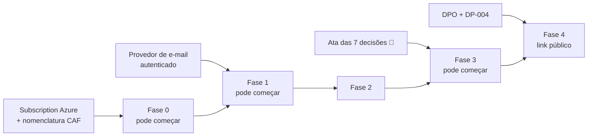

# 21. Checklist de handoff

O que o time de backend precisa ter **em mãos** antes de abrir a IDE. Cada item tem responsável, formato de entrega e o que acontece se faltar.

Convenção: 🔴 **bloqueia o início** · 🟠 bloqueia uma fase específica · 🟡 pode ser resolvido durante o desenvolvimento.

---

## 21.1 Produto e regras

| ✔ | Item | Responsável | Formato | Se faltar | Prior. |
|:-:|---|---|---|---|:--:|
| ☐ | **Ata das 7 decisões 🔴** (`DP-001`, `004`, `009`, `011`, `012`, `013`, `014`) | Produto | Ata com decisão por ID e data | **Fase 3 não começa** — o coração do produto fica bloqueado | 🔴 |
| ☐ | Confirmação (ou veto) das decisões 🟠 | Produto | E-mail/Confluence; silêncio = adotar a recomendação | Risco de migração de dados depois | 🟠 |
| ☐ | Regras de negócio `RN-*` do [capítulo 6](06-regras-de-negocio.md) revisadas e aprovadas | Produto + Tech Lead | Aprovação por seção (`RN-AUTH`, `RN-LEAGUE`, …) | Regra descoberta em code review = retrabalho | 🔴 |
| ☐ | **Critérios de ranking assinados** (fórmula, ordem de desempate, arredondamento) | Produto | Confirmação explícita de `DP-009` | Mudar depois reprocessa todo o histórico | 🔴 |
| ☐ | Papéis e permissões da [matriz §3.2](03-atores-permissoes.md) validados | Produto | Revisão da matriz | Autorização errada = incidente de segurança | 🔴 |
| ☐ | Resposta às 11 inconsistências do mockup (`INC-01..11`) | Produto + Design | Confirmação de que o **dataset canônico** é a referência | Números do app não fecharão entre telas | 🔴 |
| ☐ | Definição do que é MVP vs. pós-MVP ([§1.6](01-resumo-executivo.md)) aprovada | Produto | Aprovação da tabela de escopo | Escopo cresce durante a execução | 🔴 |
| ☐ | Renomear "Maiores derrotas" → "Maior sequência de derrotas" (`DP-016b`) | Design | Ajuste no protótipo | KPI ambíguo em produção | 🟡 |
| ☐ | Rótulo "Ligas ativas" → "Suas ligas" na Home (`INC-05`) | Design | Ajuste no protótipo | Liga encerrada sob rótulo "ativas" | 🟡 |
| ☐ | Texto "ficou em 1º" → "está em 1º" no modal (`INC-07`) | Design | Ajuste no protótipo | Afirmação falsa com jogatina aberta | 🟡 |
| ☐ | Aceite de que o ranking exibirá `56%` onde o print mostra `55%` (`INC-01`) | Design | Confirmação | Divergência print × implementação em revisão de QA | 🟡 |
| ☐ | Texto da tela de cadastro compatível com anti-enumeração (`DP-030`) | Design + Produto | Copy revisada | Usuário sem entender por que "não deu erro" | 🟠 |
| ☐ | Sequência exata das 6 etapas do cadastro (`DP-002`) | Design | Telas ou lista ordenada | `avatarUploadToken` no `register` fica indefinido | 🟠 |

---

## 21.2 Contratos e modelo

| ✔ | Item | Responsável | Formato | Se faltar | Prior. |
|:-:|---|---|---|---|:--:|
| ☐ | **OpenAPI validada** (`0 erros` no Redocly) | Arquitetura | ✅ **Entregue** — 86 path items, 98 operações, 162 schemas | — | 🔴 |
| ☐ | Bundle único para Swagger Editor | Arquitetura | ✅ **Entregue** — `openapi/openapi.bundled.yaml` | — | 🟡 |
| ☐ | Validação da OpenAPI **no CI** | Backend | Step de pipeline | Especificação e código divergem em 2 sprints | 🔴 |
| ☐ | **Modelo de dados revisado** ([capítulo 5](05-modelo-de-dados.md)) — 38 tabelas, índices, constraints | Tech Lead + DBA | Revisão com foco nas **12 invariantes de §11.14** | Corrida de dados em produção | 🔴 |
| ☐ | Revisão específica das unique constraints parciais | DBA | Confirmação de sintaxe e plano de execução no PG 16 | Invariantes de negócio sem rede de segurança | 🔴 |
| ☐ | Aprovação da estratégia de particionamento (`audit_logs`, `notifications`) | DBA | Confirmação | Tabelas ingerenciáveis em 2 anos | 🟡 |
| ☐ | **Dataset canônico como seed** ([README §0.6](README.md)) | Arquitetura | ✅ **Entregue e verificado aritmeticamente** | Testes sem massa consistente | 🔴 |
| ☐ | Contrato de eventos de domínio ([capítulo 13](13-eventos-filas-notificacoes.md)) revisado | Tech Lead | Revisão dos 40 eventos e payloads | Evento sem consumidor ou payload insuficiente | 🟠 |
| ☐ | Catálogo de erros como **enum em código** | Backend | `ErrorCode` com teste de completude | Strings literais de erro espalhadas | 🔴 |

---

## 21.3 Integrações e ambiente

| ✔ | Item | Responsável | Formato | Se faltar | Prior. |
|:-:|---|---|---|---|:--:|
| ☐ | **Subscription Azure** com resource groups `dev`/`hml`/`prd` | Infra | Acesso concedido ao time | Nada sai do local | 🔴 |
| ☐ | Convenção de nomenclatura **CAF + LFTM** documentada para todos os recursos usados | Infra | Tabela de nomes | Recursos renomeados depois = downtime | 🔴 |
| ☐ | Domínio `encacapei.com.br` + certificado + DNS | Infra + Produto | Delegação concluída | Sem URL pública nem e-mail | 🔴 |
| ☐ | **Provedor de e-mail escolhido e domínio autenticado** (SPF + DKIM + DMARC) | Infra | ACS Email provisionado, DMARC em `p=quarantine` | Fase 1 bloqueada: sem verificação nem reset de senha | 🔴 |
| ☐ | Key Vault com soft-delete e purge protection; Managed Identity configurada | Infra | Recursos criados | Segredos em configuração = risco | 🔴 |
| ☐ | PostgreSQL Flexible Server com PostGIS habilitado, zone-redundant HA | Infra | Servidor provisionado | Busca por proximidade não funciona | 🔴 |
| ☐ | Blob Storage com os 5 containers e política de ciclo de vida | Infra | Containers criados | Sem upload de avatar | 🟠 |
| ☐ | Azure Cache for Redis | Infra | Instância provisionada | Rate limit por instância; contador sem cache | 🟠 |
| ☐ | Application Insights + workspace Log Analytics | Infra | Recursos criados | Nenhuma observabilidade | 🔴 |
| ☐ | Front Door com WAF (OWASP ruleset em prevenção) | Infra + Segurança | Configurado | Sem defesa de borda | 🟠 |
| ☐ | **Decisão sobre catálogo de locais** (`DP-018`) | Produto + Operações | Escolha registrada | Fase 4 bloqueada | 🟠 |
| ☐ | **Catálogo inicial de ~50 locais** nas capitais de lançamento | Operações | Planilha → script de seed | Aba Locais vazia; wizard sem autocomplete | 🟠 |
| ☐ | Decisão sobre geração de imagem (`DP-020`) | Produto | Escolha registrada | Botões Instagram/TikTok sem função | 🟡 |
| ☐ | Confirmação de que **não haverá** integração com API de rede social | Produto | Confirmação da decisão de §14.6 | Escopo cresce com OAuth de Meta/TikTok | 🟠 |
| ☐ | Notification Hubs provisionado (pós-MVP) | Infra | — | Push não sai | 🟡 |

---

## 21.4 Segurança e LGPD

| ✔ | Item | Responsável | Formato | Se faltar | Prior. |
|:-:|---|---|---|---|:--:|
| ☐ | **Encarregado (DPO) designado** e canal de contato definido | Jurídico | Nome + e-mail publicável | Exigência legal descumprida | 🔴 |
| ☐ | **Aprovação de `DP-004`** (dados em link público) | DPO + Produto | Decisão registrada | Fase 4 bloqueada; links publicados não voltam | 🔴 |
| ☐ | Política de privacidade redigida, incluindo **retenção em backup** e **preservação anonimizada do histórico** | Jurídico + Produto | Texto publicado antes do lançamento | Base legal frágil para a decisão mais sensível do modelo | 🔴 |
| ☐ | Termos de uso com **exigência de 18+** (`DP-029`) | Jurídico | Texto publicado | Risco de tratar dado de criança sem base legal | 🔴 |
| ☐ | Registro de operadores (Azure e, se aplicável, Google) | DPO | Inventário | Mapeamento LGPD incompleto | 🟠 |
| ☐ | Aprovação do inventário de dados pessoais e bases legais ([§15.9](15-seguranca-lgpd.md)) | DPO | Revisão da tabela | Tratamento sem base legal documentada | 🔴 |
| ☐ | Aprovação da política de retenção | DPO | Revisão da tabela | Dados retidos além do necessário | 🟠 |
| ☐ | Aprovação da **pseudonimização de terceiros na exportação** | DPO | Confirmação | Export entregaria dado pessoal de outro titular | 🟠 |
| ☐ | Revisão de segurança do [capítulo 15](15-seguranca-lgpd.md) | Segurança | Aprovação por seção | Decisões de cripto e sessão sem revisão | 🔴 |
| ☐ | Runbook de incidente de segurança com **prazo de comunicação à ANPD** | Segurança + DPO | Documento | Incidente sem processo | 🟠 |
| ☐ | Processo de acesso humano a produção (PIM/JIT com justificativa) | Infra + Segurança | Configurado | Acesso a dado pessoal sem rastro | 🟠 |
| ☐ | Checklist de segurança pré-produção ([§15.12](15-seguranca-lgpd.md)) atribuído | Tech Lead | 20 itens com responsável | Endurecimento vira improviso na última semana | 🟠 |

---

## 21.5 Qualidade e testes

| ✔ | Item | Responsável | Formato | Se faltar | Prior. |
|:-:|---|---|---|---|:--:|
| ☐ | **Casos de teste aprovados** ([capítulo 17](17-estrategia-testes.md)) — **269** casos catalogados | QA + Produto | Aprovação por bloco (`TC-HAPPY`, `TC-VAL`, `TC-AUTH`, …) | Cobertura definida por quem implementa | 🔴 |
| ☐ | Aceite da **Definition of Done por endpoint** (8 itens de §17.16) | Tech Lead + QA | Confirmação | Endpoint "pronto" sem teste de autorização | 🔴 |
| ☐ | Aceite dos alvos de cobertura: ≥ 80 % em `Domain`/`Application`, **100 %** em ranking, `businessDate` e máquinas de estado | Tech Lead | Quality gate no CI | O código mais crítico fica menos testado | 🔴 |
| ☐ | Aceite dos requisitos não funcionais ([capítulo 16](16-requisitos-nao-funcionais.md)) | Produto + Tech Lead | Aprovação dos SLOs | Sem critério objetivo de "rápido o suficiente" |🟠 |
| ☐ | Confirmação dos **dois SLIs com error budget zero** (corretude de ranking e perda de evento) | Produto + Tech Lead | Confirmação explícita | Deriva de ranking tratada como ruído | 🔴 |
| ☐ | SonarCloud configurado com **exclusão de migrações EF Core** | Backend | Configuração do projeto | Quality gate falha por código gerado | 🟠 |
| ☐ | Ambiente de testes com Testcontainers no CI | Backend | Pipeline funcional | Testes de integração viram testes com mock | 🔴 |
| ☐ | Cenários de carga (`TC-LOAD-001..008`) revisados | QA + Tech Lead | Scripts k6 | Gargalos descobertos em produção | 🟡 |

---

## 21.6 Observabilidade e operação

| ✔ | Item | Responsável | Formato | Se faltar | Prior. |
|:-:|---|---|---|---|:--:|
| ☐ | **Observabilidade planejada** ([§16.7](16-requisitos-nao-funcionais.md)) | Tech Lead | 3 dashboards especificados | Incidente sem diagnóstico | 🔴 |
| ☐ | Painel **"Jornada da jogatina"** com as 9 métricas de produto | Tech Lead + Produto | Dashboard | Problemas de UX invisíveis nas métricas técnicas | 🟠 |
| ☐ | Alertas de §16.8 configurados, **cada um com runbook** | Tech Lead + Infra | 16 alertas + 16 runbooks | Alerta sem ação treina o time a ignorar | 🟠 |
| ☐ | Alerta de **deriva de ranking** como P1 | Tech Lead | Configurado | O pior bug possível passaria em silêncio | 🔴 |
| ☐ | Runbook de restauração de backup **com reaplicação de anonimizações** | Infra + DPO | Documento ensaiado | Restauração ressuscita dados excluídos (violação LGPD) | 🟠 |
| ☐ | Runbook de DR com RTO de 4 h validado | Infra | Documento + ensaio | RTO é promessa não verificada | 🟠 |
| ☐ | Teste de restauração de backup executado e documentado | Infra | Evidência | Backup não verificado é backup inexistente | 🟠 |
| ☐ | Janela de manutenção acordada (03:00–05:00 BRT) | Produto + Infra | Confirmação | Manutenção no meio da jogatina | 🟡 |
| ☐ | Canal de suporte e processo de escalonamento | Produto | Definido | Usuário sem caminho para reportar ranking errado | 🟡 |

---

## 21.7 Desenvolvimento

| ✔ | Item | Responsável | Formato | Se faltar | Prior. |
|:-:|---|---|---|---|:--:|
| ☐ | Repositório criado com branch protection e revisão obrigatória | Tech Lead | Configurado | — | 🔴 |
| ☐ | **Ambientes e secrets definidos** (`dev`/`hml`/`prd` isolados) | Infra | Key Vault por ambiente | Segredo de produção em ambiente inferior | 🔴 |
| ☐ | Confirmação de que **nenhum dado de produção** vai para ambiente inferior | Segurança + Infra | Política escrita | Violação LGPD por massa de teste | 🔴 |
| ☐ | Docker Compose local (Postgres + PostGIS + Redis + Azurite) | Backend | `docker-compose.yml` + README | Onboarding de dias em vez de minutos | 🟠 |
| ☐ | Padrão de commit, PR e template de revisão | Tech Lead | Documento | — | 🟡 |
| ☐ | **ADRs das decisões `[R]`** deste documento | Tech Lead | 20 ADRs em `/docs/adr` | Decisão técnica sem racional registrado | 🟠 |
| ☐ | Política de migração expand/contract documentada | Tech Lead | Documento | Rollback com perda de dados | 🟠 |
| ☐ | Contrato de colaboração com o time mobile (quem faz o quê — §1.5) | Tech Lead + Mobile | Documento | Retrabalho de fronteira (formatação, cálculo, autorização) | 🟠 |

---

## 21.8 Critérios de aceite acordados

| ✔ | Item | Responsável | Prior. |
|:-:|---|---|:--:|
| ☐ | **`TC-E2E-002` como critério de aceite do MVP**: a noite canônica de 9 partidas produz ranking `8/2 · 7/4 · 5/4 · 4/6 · 3/7`, pódio `4 · 3 · 2 · 0`, Home `47 partidas / 62 % / 5 consecutivas` e h2h `5 × 3` | Produto + QA + Tech Lead | 🔴 |
| ☐ | Critérios de aceite por fase ([capítulo 20](20-roadmap-tecnico.md)) aprovados | Produto + Tech Lead | 🔴 |
| ☐ | Definição de "pronto para produção": checklist de §15.12 + SLOs de §16.11 + `TC-E2E-001..015` verdes | Produto + Tech Lead | 🔴 |
| ☐ | Acordo sobre a **política de error budget** (75 % consumido → parar features) | Produto + Tech Lead | 🟠 |
| ☐ | Gatilhos objetivos de repriorização pós-MVP ([§20.8](20-roadmap-tecnico.md)) aceitos | Produto | 🟡 |

---

## 21.9 Resumo — o que realmente bloqueia

Dos 70 itens acima, **21 são 🔴**. Agrupados por dono:

| Responsável | Itens 🔴 | O mais urgente |
|---|:--:|---|
| **Produto** | 8 | Ata das 7 decisões bloqueantes |
| **Infra** | 6 | Subscription Azure + provedor de e-mail autenticado |
| **Tech Lead** | 4 | Revisão do modelo de dados e das invariantes |
| **Jurídico / DPO** | 2 | DPO designado + `DP-004` |
| **QA** | 1 | Aprovação dos casos de teste |

**Caminho crítico do handoff:**

> **Leitura prática:** a **Fase 0 começa com dois itens** — acesso ao Azure e a convenção de nomenclatura. Nada mais é bloqueante para o dia 1. Isso dá **cinco semanas de folga** para Produto fechar as 7 decisões 🔴 antes de a Fase 3 precisar delas — desde que a reunião esteja na agenda **agora**, e não quando a Fase 2 terminar.

## 21.10 O que já está entregue nesta especificação

| Item | Onde |
|---|---|
| Análise funcional completa do mockup (12 telas, 3 modais, ~130 ações mapeadas) | [capítulo 2](02-analise-funcional.md) |
| Matriz de permissões com autorização em nível de objeto | [capítulo 3](03-atores-permissoes.md) |
| 16 módulos com responsabilidade, entidades, casos de uso e eventos | [capítulo 4](04-dominios-modulos.md) |
| Modelo de dados: 38 tabelas, ER em Mermaid, índices, constraints, soft delete, locking | [capítulo 5](05-modelo-de-dados.md) |
| **181** regras de negócio identificadas, com origem, exceções e impacto técnico | [capítulo 6](06-regras-de-negocio.md) |
| Padrões de API: versionamento, paginação, filtros, cache, rate limit, idempotência, ETag | [capítulo 7](07-padroes-api.md) |
| Catálogo de ~90 endpoints com contratos, validações e exemplos completos | [capítulos 8a–8e](08a-endpoints-auth-users.md) |
| Fluxo fim a fim em 22 requisições HTTP reais e consistentes | [capítulo 9](09-exemplos-contratos.md) |
| Catálogo de 131 códigos de erro em Problem Details (RFC 9457) | [capítulo 10](10-catalogo-erros.md) |
| **15** diagramas de estado em Mermaid, com transições, atores e efeitos | [capítulo 11](11-maquinas-estado.md) |
| Ranking: fórmula, desempates, reprocessamento determinístico e **verificação aritmética completa** | [capítulo 12](12-ranking-calculos.md) |
| 40 eventos de domínio com produtor, consumidores, payload e idempotência | [capítulo 13](13-eventos-filas-notificacoes.md) |
| 13 integrações avaliadas com riscos, alternativas e plano de degradação | [capítulo 14](14-integracoes-externas.md) |
| Segurança e LGPD: inventário, bases legais, retenção, anonimização, 20 controles | [capítulo 15](15-seguranca-lgpd.md) |
| RNFs mensuráveis com SLOs, error budget e alvos por endpoint | [capítulo 16](16-requisitos-nao-funcionais.md) |
| **269** casos de teste em 7 níveis, com o dataset canônico como massa | [capítulo 17](17-estrategia-testes.md) |
| OpenAPI 3.1 **validada** (86 path items, 98 operações, 162 schemas, 0 erros) | [openapi/](openapi/README.md) |
| **33** decisões pendentes com alternativas, recomendação e impacto | [capítulo 19](19-decisoes-pendentes.md) |
| Roadmap de 16 semanas com riscos e critérios de aceite por fase | [capítulo 20](20-roadmap-tecnico.md) |
