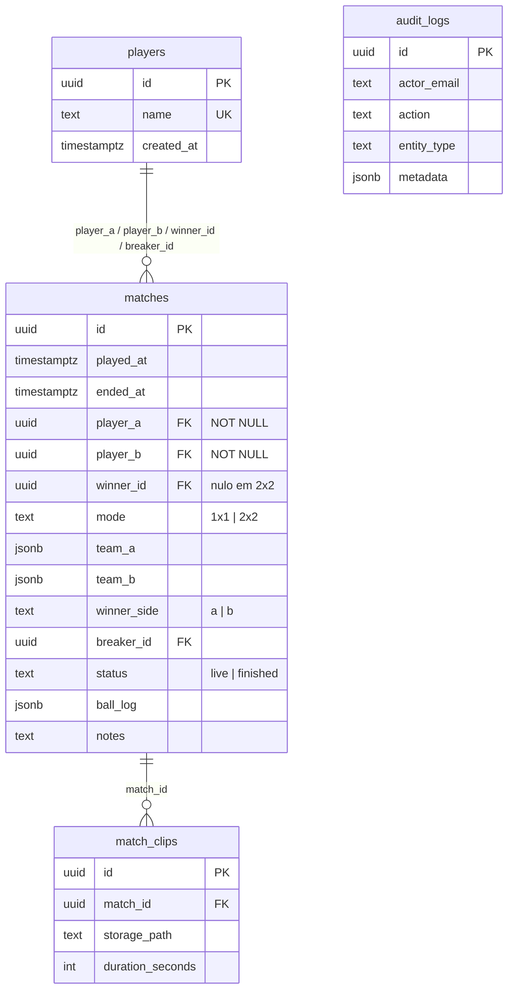

# Modelo de Dados

Fonte da verdade: `schema.sql` na raiz. Migrations incrementais em `docs/migrations/`.



## `matches` — o coração

Duas gerações de schema convivem na mesma tabela: o modelo 1x1 original (`player_a`, `player_b`, `winner_id`) e o modelo de [[Duplas 2x2]] (`team_a`, `team_b`, `winner_side`). A migration `docs/migrations/20260728_add_doubles.sql` fez a ponte.

**Regra importante:** `player_a` e `player_b` continuam `NOT NULL` mesmo em partidas 2x2. Numa dupla, eles guardam o primeiro jogador de cada lado; a dupla completa vive em `team_a`/`team_b`.

### Constraints que o app pode confiar
| Constraint | Garante |
| --- | --- |
| `matches_distinct_players` | `player_a <> player_b` |
| `matches_winner_participates` | `winner_id` é nulo, ou é `player_a`, ou é `player_b` |
| `matches_finished_has_winner` | Partida `finished` tem `winner_id` **ou** `winner_side` |
| `matches_mode_check` | `mode ∈ ('1x1','2x2')` |
| `matches_winner_side_check` | `winner_side ∈ ('a','b')` ou nulo |
| `matches_team_shape_check` | Em 2x2: os dois times são arrays de 2, sem jogador repetido nem cruzado |

> [!note] A constraint que permite um estado que o código não trata
> `matches_finished_has_winner` aceita uma partida **1x1** finalizada só com `winner_side`, sem `winner_id`. `computeStats()` lê `winner_id` cru e nesse caso não credita a vitória a ninguém e ainda dá uma derrota fantasma ao `player_a`. Nos dados de homologação isso **não ocorre** (0 casos) — é um risco latente, não um bug ativo. Ver [[AUD-10 Achados latentes e menores]].

### `ball_log`
Array JSON ordenado. Cada entrada:
```json
{ "n": 1, "ball": "7", "by": "<uuid>", "type": "pot", "reason": "oponente", "brk": true }
```
- `type`: `"pot"` (encaçapou) ou `"foul"` (falta).
- `reason`: `"oponente"`, `"trunfo"`, `"scratch"`, `"branca"`, `"juiz"`.
- `brk`: veio da quebra.
- **É opcional.** Em homologação, 83% das partidas têm `ball_log` vazio.

## Trigger e índices
- `matches_touch_updated_at` — atualiza `updated_at` em todo UPDATE.
- `matches_played_at_idx` — `played_at desc`.
- `audit_logs_created_at_idx`, `match_clips_match_id_idx`.
- `matches_single_live_idx` foi **removido** de propósito: hoje há mais de uma mesa e várias partidas ao vivo simultâneas são esperadas. Ver [[Partida ao Vivo]].

Relacionado: [[Segurança e RLS]] · [[Estatísticas e Ranking]] · [[Banco de Homologação]]
