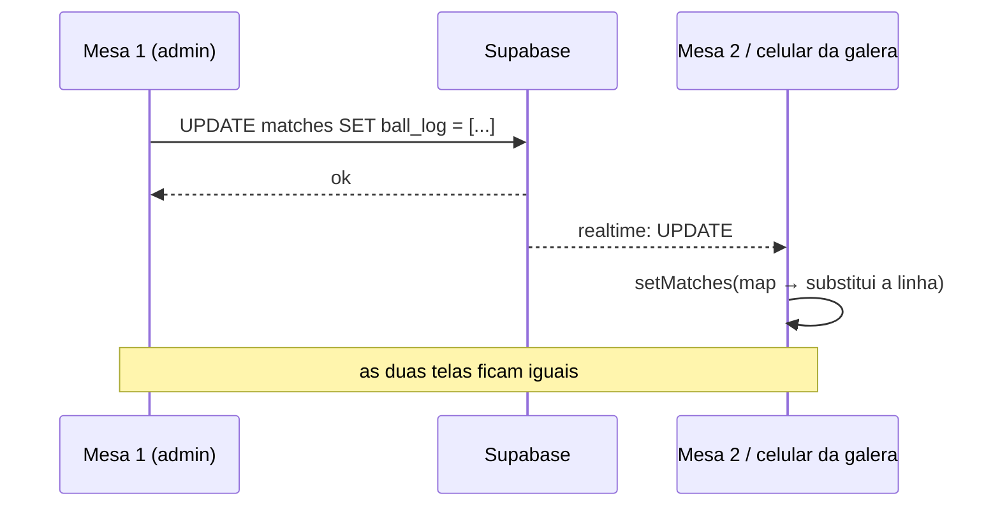

# Tempo Real

A tabela `matches` está na publicação `supabase_realtime` (`schema.sql:118-126`). O objetivo declarado no próprio schema: *"cada tela (por mesa) reflete o que acontece nas outras sem precisar de reload manual"*.

## Como funciona
`supabaseRepository.onMatchesChange()` abre o canal `matches-changes` e escuta `event: "*"`. O handler vive em `src/App.jsx`:

```js
setMatches((items) => {
  if (eventType === "DELETE") return items.filter((match) => match.id !== oldRow.id);
  const exists = items.some((match) => match.id === newRow.id);
  const next = exists
    ? items.map((match) => (match.id === newRow.id ? newRow : match))
    : [...items, newRow];
  return sortByPlayedAt(next);   // reordena sempre, mesmo com insercao retroativa
});
```



## O que foi corrigido

> [!success] 1. Inserção retroativa não quebra mais a ordem cronológica (2026-08-20)
> O handler agora passa o resultado por `sortByPlayedAt()` antes de gravar no estado. O admin pode registrar uma partida com data retroativa (o campo `data e hora` em `AdminView.jsx` é editável) sem que a linha antiga entre no fim do array e bagunce sequências ou o dia exibido. Ver [[AUD-05 Realtime quebra a ordem cronológica]].

## O que continua em aberto

> [!bug] Escrita do `ball_log` ainda é last-write-wins entre mesas diferentes
> `appendBall()` monta `[...log, entry]` a partir da cópia local e sobrescreve a coluna inteira. Desde 2026-08-20 existe uma trava (`serialize()` em `LiveMatchPanel`) que impede dois toques rápidos **no mesmo aparelho** de se atropelarem. Mas duas mesas anotando a mesma partida ao mesmo tempo ainda perdem bola: falta escrita atômica no banco (função SQL `append_ball`).
> Ver [[AUD-06 Perda de bolas no ball_log]].

## O que já é robusto
- `DELETE` e `UPDATE` são tratados corretamente (filtro e substituição por `id`).
- O canal é limpo no unmount (`removeChannel`), sem vazamento de subscription.
- A partida ao vivo nunca entra nas estatísticas (`status !== "live"` em `src/App.jsx`), então uma linha ao vivo chegando via realtime não mexe no ranking.

Relacionado: [[Partida ao Vivo]] · [[Visão Geral da Arquitetura]] · [[2026-08-20 - Correções da auditoria de 20-08]]
