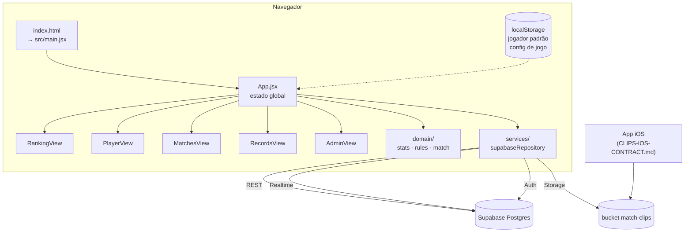

# Visão Geral da Arquitetura

Não existe backend próprio. O app é um SPA que fala direto com o Supabase, e toda a regra de negócio roda **no cliente**.



## As peças

| Camada | Onde | Responsabilidade |
| --- | --- | --- |
| Entrada | `index.html` → `src/main.jsx` | Cria o cliente Supabase a partir das env vars e monta o React |
| Estado | `src/App.jsx` | **Único dono do estado**: players, matches, clips, sessão, auditoria |
| Domínio | `src/domain/` | Funções puras. Sem React, sem rede. Ver [[Camada de Domínio]] |
| Views | `src/views/` | Telas. Recebem tudo por prop, não buscam dados |
| Serviço | `src/services/supabaseRepository.js` | **Única** superfície de acesso ao Supabase. Ver [[Serviços e Supabase]] |
| Utilitários | `src/utils/` | Datas ([[Dia de Jogatina]]) e helpers de jogador |
| Compartilhamento | `src/share/winnerShareImage.js` | Desenha a imagem do vencedor num `<canvas>` |

## Decisões de arquitetura que importam

**1. Todo cálculo é no cliente.** O banco guarda fatos crus (partidas e o `ball_log`); ranking, streaks e records são derivados em memória a cada render. Vantagem: zero backend, mudar uma regra é mudar uma função pura. Custo: todo cliente baixa **todas** as partidas, e duas versões do app podem exibir números diferentes.

**2. Nada é paginado.** `loadScoreboard()` faz `select("*")` sem `limit` nas três tabelas. Com 406 partidas isso é irrelevante; a conta muda de figura na casa dos milhares. Ver [[Serviços e Supabase]].

**3. O App.jsx é o único dono do estado.** Nenhuma view chama o repositório. Isso é bom e deve ser preservado — é o que torna o domínio testável.

**4. `finished` é o portão de entrada das estatísticas.** `src/App.jsx:39` define o conjunto que conta:
```js
matches.filter((m) => m.status !== "live" && (m.winner_id || m.winner_side))
```
Toda view recebe esse array já filtrado. Partida ao vivo nunca polui o ranking.

> [!warning] A ordem do array é uma dependência implícita
> Várias contas assumem que `matches` está em ordem crescente de `played_at`, mas nada garante isso depois que o [[Tempo Real|realtime]] entrega uma linha nova. Ver [[AUD-05 Realtime quebra a ordem cronológica]].

Relacionado: [[Mapa do Código]] · [[Modelo de Dados]] · [[Tempo Real]]
