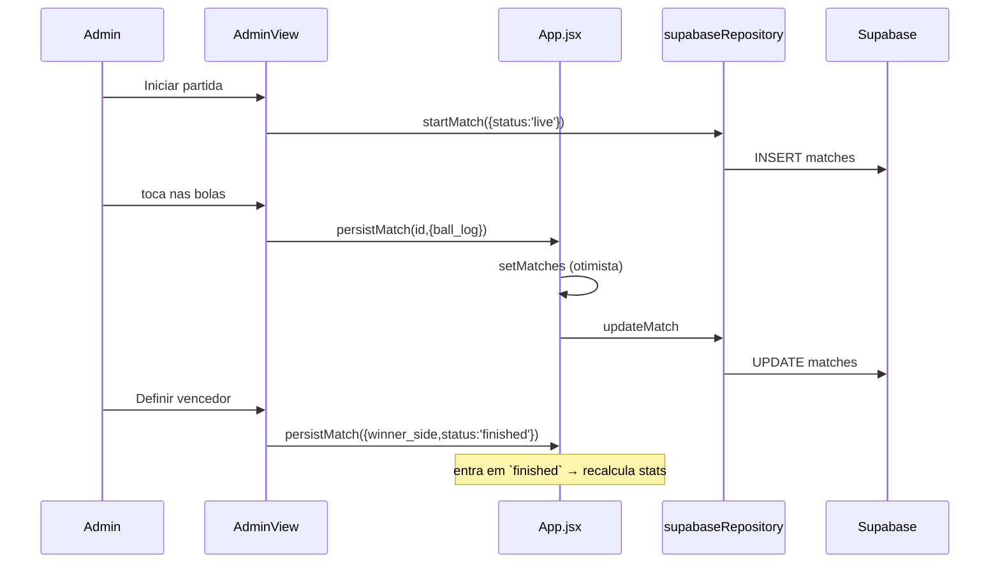

# Mapa do Código

Ponto de entrada real: `index.html` → `/src/main.jsx` → `src/App.jsx`.

```
src/
├── main.jsx                    ← entrada REAL (22 linhas)
├── App.jsx                     ← estado global, roteamento por aba (359)
├── constants.js                ← navegação, cores das bolas, meses
├── domain/                     ← funções puras, sem React  ⭐ o coração
│   ├── stats.js    (242)       ← ranking, streaks, records
│   ├── rules.js    (237)       ← modos de jogo, classificação de tacada
│   ├── match.js     (45)       ← abstração 1x1 / 2x2
│   ├── stats.test.js
│   └── rules.test.js
├── utils/
│   ├── date.js      (59)       ← dia de jogatina, formatação
│   ├── player.js    (12)       ← iniciais e cor por hash
│   └── *.test.js
├── services/
│   └── supabaseRepository.js   ← ÚNICA porta para o Supabase (103)
├── views/
│   ├── AdminView.jsx   (988)   ← login, partida ao vivo, jogadores, config, logs
│   ├── PlayerView.jsx  (800)   ← perfil, evolução, confrontos
│   ├── RankingView.jsx (316)   ← ranking geral + painel do dia
│   ├── RecordsView.jsx  (52)
│   ├── MatchesView.jsx  (48)
│   └── RulesView.jsx    (25)
├── components/                 ← bolas, sheets, modais, layout
├── share/winnerShareImage.js   ← imagem do vencedor via canvas (225)
├── styles.css          (1182)  ← CSS real do app
│
├── app/                        ⚠️ CÓDIGO MORTO — export do Figma (1717 + shadcn)
├── main.tsx                    ⚠️ CÓDIGO MORTO — entrada alternativa
├── imports/                    ⚠️ do export do Figma
└── styles/                     ⚠️ tailwind/shadcn, não usados pelo app real
```

Ver [[Código Morto e Duplicado]] para o que pode ser removido.

## Como ler este código

**1. Comece pelo domínio.** `src/domain/` e `src/utils/date.js` somam ~600 linhas de funções puras e contêm praticamente toda a regra de negócio. São testáveis sem navegador e é onde moram os bugs que importam.

**2. `App.jsx` é o único que tem estado.** Todas as views são funções de suas props. Nenhuma view chama o repositório.

**3. As views grandes são grandes por acumulação.** `AdminView.jsx` tem 988 linhas com 12 componentes internos; `PlayerView.jsx` tem 800. Não há divisão em arquivos, mas os componentes internos são razoavelmente coesos.

## Fluxo de uma partida registrada


Relacionado: [[Camada de Domínio]] · [[Camada de Views]] · [[Serviços e Supabase]]
