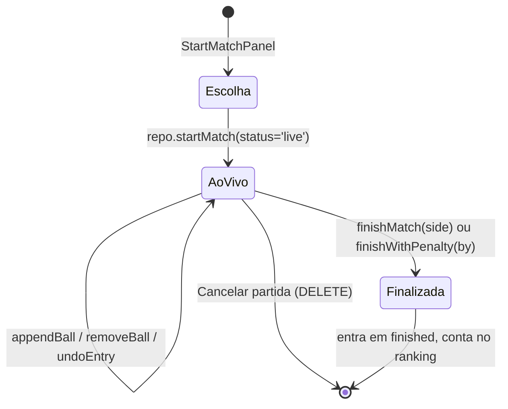

# Partida ao Vivo

O fluxo mais complexo do app. Vive em `src/views/AdminView.jsx` (988 linhas) e só é acessível ao admin logado.

## Fluxo

## Quem entra em qual painel
`LiveMatchRouter` (`AdminView.jsx:563`) decide:
- **`SimpleLiveMatchPanel`** — para [[Duplas 2x2]], ou quando "anotar bolas" está desligado, ou nos modos `knockout` / `three-balls`. Só pergunta quem ganhou.
- **`LiveMatchPanel`** — 1x1 com anotação. Tabuleiro completo, grupos, faltas, bola de castigo.

## Múltiplas mesas
O índice `matches_single_live_idx` foi removido de propósito do schema: *"hoje há mais de uma mesa"*. Várias partidas ao vivo simultâneas são um recurso, não um acidente. `StartMatchPanel` esconde da lista quem já está jogando (`busyPlayerIds`, `AdminView.jsx:457`).

## Como uma bola é registrada
`appendBall()` (`AdminView.jsx:729`):
1. Monta `entry = { n: log.length + 1, ball, by, type, reason?, brk? }`
2. Monta `nextLog = [...log, entry]`
3. `persistMatch(id, { ball_log: nextLog })` — **sobrescreve a coluna inteira**
4. Grava um registro em `audit_logs`

`removeBall` e `undoEntry` refazem a numeração `n` do zero depois de remover.

## Problemas conhecidos

> [!bug] Perda de bola por escrita concorrente
> O passo 2 lê a cópia local e o passo 3 sobrescreve tudo. Duas mesas anotando a mesma partida, ou dois toques rápidos, e uma bola some. Não há travamento nem merge no servidor. Ver [[AUD-06 Perda de bolas no ball_log]].

> [!bug] Duplo clique cria duas partidas ao vivo
> O botão "Iniciar partida" (`AdminView.jsx:529`) não é desabilitado durante o `await repo.startMatch(...)`, e a checagem de jogador ocupado é feita só na renderização. Nada no banco impede duas partidas `live` com os mesmos jogadores. Ver [[AUD-07 Duplo clique cria partida duplicada]].

> [!bug] Definir vencedor não trava contra duplo toque
> `finishMatch()` (`AdminView.jsx:619`) só fecha o overlay **depois** das chamadas de rede. Dois toques geram duas escritas e dois registros de auditoria.

> [!warning] A configuração de regras não acompanha a partida
> `LiveMatchRouter` lê `loadGameSettings()` do `localStorage` **a cada render**. A partida não guarda sob qual [[Modos de Jogo|modo]] foi jogada, então a mesma partida pode ser classificada de formas diferentes em aparelhos diferentes. Ver [[AUD-08 Configurações vivem no localStorage]].

> [!question] "Grupo limpo" conta bola derrubada pelo adversário
> `isGroupCleared()` (`rules.js:191`) marca como removida qualquer bola que apareça no log, inclusive as que o adversário encaçapou por engano (falta). Na prática a bola realmente saiu da mesa, então isso pode ser o comportamento correto — mas é uma **decisão de regra que não está documentada**. Vale confirmar com a turma.

Relacionado: [[Modos de Jogo]] · [[Tempo Real]] · [[Modelo de Dados]]
